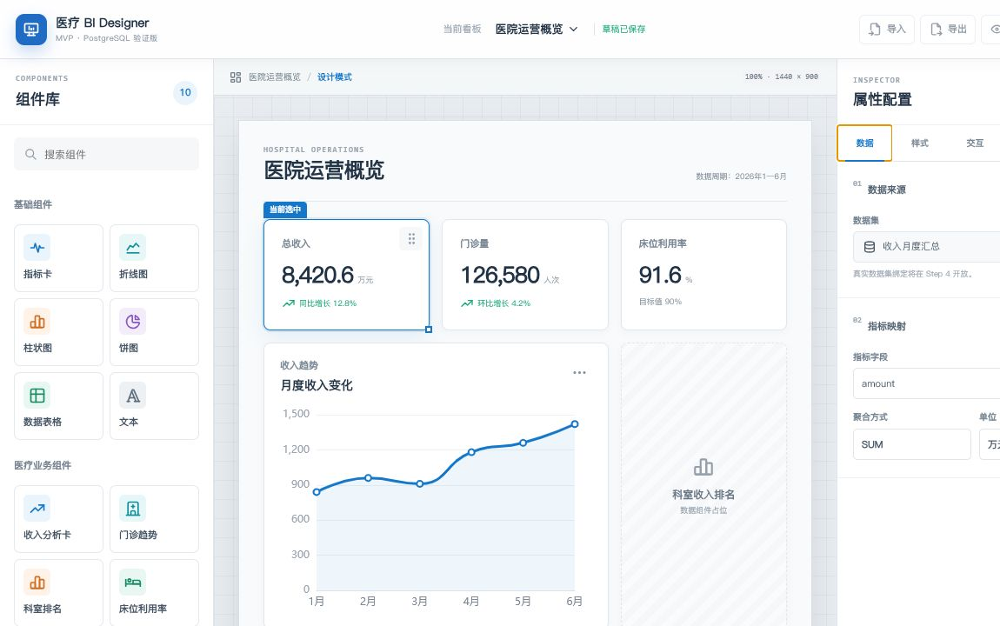

# Step2 三栏设计器验收记录

Step2 已完成并通过构建、浏览器结构检查与交互验证。当前版本只交付设计器工作区结构，不提前开放组件添加、拖拽、缩放、删除或真实数据绑定。

## 完成内容

- 顶部工具栏已包含当前看板、保存状态、导入、导出、预览和保存入口；未实现功能保持禁用。
- 左侧组件库包含 6 个基础组件和 4 个医疗业务组件，并支持名称搜索。
- 中间画布提供网格工作区、医院运营概览示例、组件选中态和 ECharts 趋势图。
- 右侧属性面板包含数据、样式、交互、布局和高级五个 Tab；样式标题可即时反映到选中组件。
- 页面在 1180px、900px 和 680px 设置了桌面、平板和移动端适配规则，并支持减少动效偏好。
- Step1 页面源码保留在 `src/views/DesignerStep1.vue`，当前路由页面为 `src/views/DesignerHome.vue`。

## 验证结果

- `npm run build` 通过，TypeScript 类型检查无错误。
- 浏览器检测到左、中、右三个面板、10 个组件入口、5 个属性 Tab、5 个画布组件和 1 个 ECharts Canvas。
- 组件搜索可将 10 项筛选为“床位利用率”，清空后可恢复全部组件。
- 属性面板可从“数据”切换到“样式”并正确显示组件标题输入框。
- 页面控制台无错误；1280px 视口下页面宽度、工作区宽度和工具栏宽度一致，无横向溢出。

## 已知问题

- ECharts 与 Tabler 当前整包引入，生产构建仍提示单个 JavaScript Chunk 超过 500 KB；后续应改为按需引入和路由拆包。
- 组件库按钮在 Step2 只用于展示和搜索，添加、拖拽、缩放、删除及布局 JSON 持久化将在 Step3 实现。
- 平板视口隐藏右侧属性面板，移动视口同时隐藏左侧组件库；后续可按产品需要改为抽屉式面板。

## 下一步

Step3 将建立统一组件实例模型，实现组件添加、选择、移动、缩放、删除与布局 JSON 序列化，并在完成后重新构建和截图验收。
