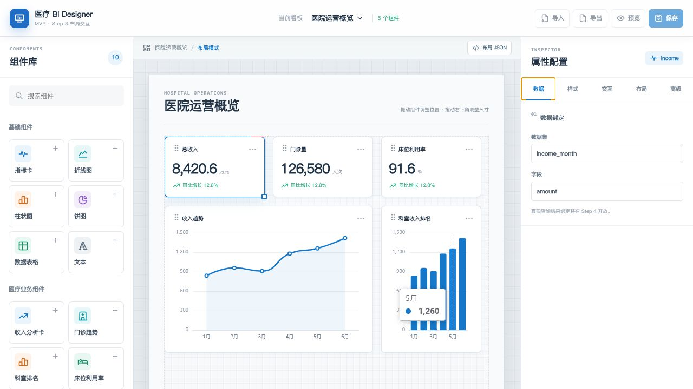

# Step3 组件布局交互验收记录

Step3 已完成组件实例模型、画布交互和布局 JSON 序列化。真实数据绑定、持久化保存以及 JSON 导入导出仍属于 Step4。

## 完成内容

- 看板组件统一保存 `id`、`type`、`position`、`dataConfig` 和 `styleConfig`。
- 左侧 10 个组件支持单击添加，并实现原生 HTML5 拖入画布处理器。
- 组件支持选中、指针移动、右下角缩放、画布边界限制和层级提升。
- 支持组件内删除、属性面板删除和键盘 `Delete` / `Backspace` 删除。
- 右侧布局面板可直接修改 X、Y、宽度和高度，修改结果即时反映到画布。
- 高级面板可查看当前组件 JSON 和完整看板 JSON。
- 图表抽离为可复用 ECharts 组件，并通过 `ResizeObserver` 跟随组件尺寸变化。
- Step1、Step2 页面分别保留在 `DesignerStep1.vue` 和 `DesignerStep2.vue`。

## 自动化验证结果

- `npm run build` 通过，TypeScript 类型检查无错误。
- 初始状态包含 5 个组件、2 个 ECharts Canvas、10 个组件入口和 5 个属性 Tab。
- 单击“文本”后组件数从 5 增加到 6，新增组件自动选中并打开布局面板。
- 属性面板将 X 坐标从 `114` 修改为 `200` 后，组件样式同步为 `left: 200px`。
- 指针移动测试将新增组件位置更新为 `240 / 144`。
- 缩放测试将新增组件尺寸更新为 `300 × 118`。
- 删除测试将组件数恢复为 5，新增文本组件从画布移除。
- 高级面板输出的组件 JSON 可解析，位置字段与画布状态一致。
- 页面控制台无应用错误。

## 待人工复核

浏览器自动化的坐标拖动没有触发 HTML5 `dataTransfer`，因此“从组件库原生拖入画布”未能自动化验收。页面已确认组件按钮具有 `draggable="true"`，画布已注册 `dragover/drop` 处理器；请使用真实鼠标做一次拖入复核。单击添加、画布内移动、缩放和删除均已通过浏览器验证。

## 已知问题与下一步

- 数据和样式修改当前只存在于内存，刷新页面会恢复初始看板；Step4 将增加本地保存及 JSON 导入导出。
- 生产包仍有超过 500 KB 的提示，后续需要对 ECharts 做按需引入。
- Step4 将实现统一看板模型持久化、JSON 导入导出、组件数据配置和模拟数据集绑定。
