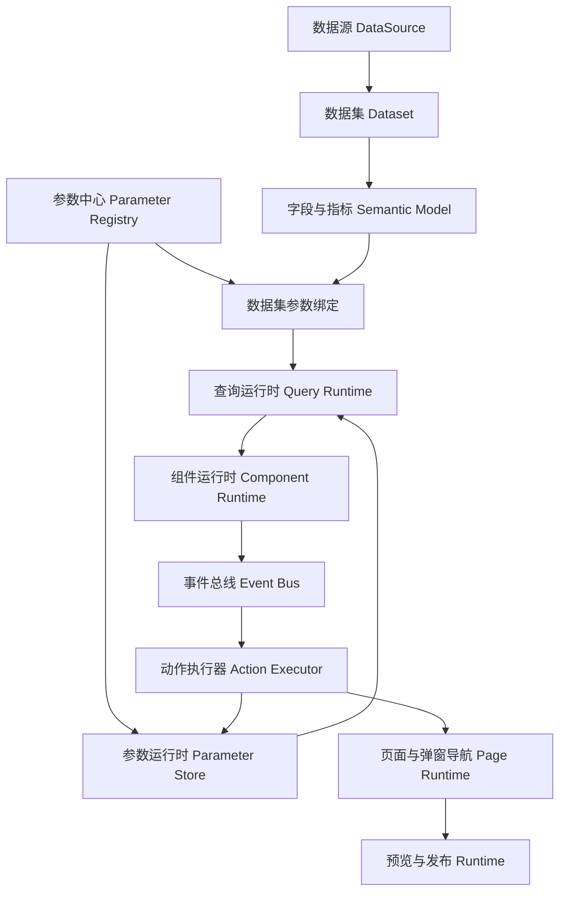

# 医疗 BI Designer V3 Phase7—12 整体架构与数据模型设计

本文用于冻结 Phase7—12 的开发边界和依赖顺序。结论是：后续版本应从“单画布组件配置”升级为“多页面看板应用”，采用 V3 JSON；参数定义、运行时参数值、事件动作、页面导航和发布快照必须分层，不能继续向组件内部追加临时字段。

## 一、核心架构决策

1. 看板根模型由 V2 单页面结构升级为 V3 看板应用结构，根节点管理参数、页面、主题、发布配置和默认页面。
2. 参数定义与参数运行值分离。JSON 保存参数编码、类型、默认值和来源，不保存用户本次浏览产生的临时筛选值。
3. 数据集声明自己可接收的查询参数，参数中心通过绑定关系映射到数据集，不允许组件直接拼接 SQL。
4. 组件事件统一使用“事件 → 条件 → 动作 → 参数映射 → 目标”的声明式模型，不在组件渲染代码中堆叠业务 `if`。
5. 多页面模型必须先于页面跳转和下钻落地；发布能力必须建立在多页面运行时与参数运行时稳定之后。
6. 医疗业务组件继续采用基础组件快照，不产生独立渲染分支；模板额外携带默认参数、默认事件和默认跳转。
7. Phase7 合并处理当前文档中的小修项，但不改变后续阶段的主依赖关系。

## 二、总体架构



设计态和运行态分离：

| 层级 | 保存内容 | 不保存内容 |
| --- | --- | --- |
| 数据集层 | SQL、字段语义、查询参数声明、参数绑定 | 数据库密码、临时查询值 |
| 看板应用层 | 页面、组件、参数定义、事件动作、主题、发布配置 | 当前用户的临时筛选状态 |
| 运行时层 | 当前参数值、下钻栈、页面栈、查询缓存 | 不回写设计 JSON |
| 发布层 | 不可变版本快照、入口页、权限和环境配置 | 编辑器草稿状态 |

## 三、V3 根模型

V2 当前根结构为：

```text
DashboardModelV2
├── canvas
├── titleStyle
└── components[]
```

V3 调整为：

```text
DashboardApplicationV3
├── metadata
├── parameters[]
├── pages[]
│   ├── canvas
│   ├── titleStyle
│   ├── controls[]
│   └── components[]
├── theme
├── runtimePolicy
└── publishConfig
```

建议根模型：

```ts
interface DashboardApplicationV3 {
  version: 3
  id: string
  name: string
  description?: string
  defaultPageId: string
  parameters: ParameterDefinitionV3[]
  pages: DashboardPageV3[]
  theme: ThemeConfig
  runtimePolicy: RuntimePolicy
  publishConfig?: PublishConfig
  createdAt?: string
  updatedAt?: string
}
```

## 四、参数体系设计

### 参数定义

```ts
interface ParameterDefinitionV3 {
  id: string
  code: string
  name: string
  type: 'string' | 'number' | 'date' | 'dateRange' | 'singleSelect' | 'multiSelect'
  scope: 'application' | 'page'
  pageId?: string
  required: boolean
  defaultValue?: unknown
  source: ParameterValueSource
  validation?: ParameterValidation
  aliases?: string[]
}

type ParameterValueSource =
  | { kind: 'static'; options: Array<{ label: string; value: unknown }> }
  | { kind: 'dictionary'; dictionaryCode: string }
  | { kind: 'dataset'; datasetId: string; valueField: string; labelField: string }
  | { kind: 'system'; systemCode: string }
  | { kind: 'derived'; expression: ParameterExpression }
```

参数运行值单独存在于运行时：

```ts
interface ParameterRuntimeState {
  values: Record<string, unknown>
  source: Record<string, 'default' | 'control' | 'event' | 'navigation' | 'system'>
  updatedAt: Record<string, number>
  transactionId: string
}
```

### 系统参数与内置字典

系统预置模板：

| 参数编码 | 类型 | 默认规则 |
| --- | --- | --- |
| `year_code` | 单选 | 当前年份 |
| `month_code` | 单选 | 当前月份，格式 `01`—`12` |
| `b_date` | 日期 | 当前日期或日期模式推导值 |
| `e_date` | 日期 | 当前日期或日期模式推导值 |
| `code_lv1` | 单选 | 空 |
| `code_lv2` | 单选 | 空 |
| `doctor_code` | 单选 | 空 |
| `flag` | 单选 | `dateRange` |

为兼容已有医疗模型，`dept_code` 可配置为 `code_lv1` 或 `code_lv2` 的别名，但运行时只保留一个标准编码。

内置字典不固化所有选项到看板 JSON，只保存字典编码：

- `builtin.year`：2023 年至系统当前年份。
- `builtin.month`：`01`—`12`。
- `builtin.dateShortcut`：今天、昨天、近 7 天、近 15 天、近 1 个月、月初至今、年初至今。

`flag` 建议使用枚举：

- `dateRange`：直接使用 `b_date`、`e_date`。
- `currentMonth`：推导当前年月与当月日期范围。
- `cumulative`：推导当年 1 月 1 日至当前选定月份末日，不使用字符串形式的 `year_code <= month_code`。

## 五、数据集参数模型

数据集应声明“它需要什么参数”，看板参数中心负责“由谁提供参数值”。

```ts
interface DatasetQueryParameter {
  id: string
  code: string
  name: string
  type: ParameterDefinitionV3['type']
  required: boolean
  sqlName: string
  defaultValue?: unknown
}

interface DatasetParameterBinding {
  id: string
  datasetId: string
  datasetParameterCode: string
  parameterId: string
  transform?: ParameterTransform
  emptyPolicy: 'omit' | 'null' | 'emptyString' | 'reject'
}
```

自动绑定规则：

1. 先按参数编码精确匹配。
2. 再按参数别名匹配。
3. 无法匹配时进入人工映射。
4. 批量绑定只生成候选关系，用户确认后保存。

SQL 执行必须使用参数化查询。若需要兼容帆软风格 `${if(...)}`，只能由受限解析器转换为条件 AST，再生成带占位符的 SQL；禁止直接执行字符串拼接表达式。

组件数据配置增加可选覆盖关系：

```ts
interface ComponentDataConfigV3 extends ComponentDataConfigV2 {
  version: 3
  parameterBindings: Array<{
    datasetParameterCode: string
    parameterId: string
    override?: boolean
  }>
  refreshPolicy: 'onParameterChange' | 'manual' | 'onPageEnter'
}
```

## 六、多页面模型

```ts
interface DashboardPageV3 {
  id: string
  name: string
  code: string
  order: number
  type: 'standard' | 'dialog'
  canvas: CanvasConfig
  titleStyle: DashboardTitleStyle
  controls: ParameterControlComponent[]
  components: DashboardComponentV3[]
  pageEvents: EventBinding[]
}
```

页面支持新建、删除、复制和排序。删除页面前必须检查：

- 是否为默认页面。
- 是否被跳转动作引用。
- 是否被弹窗动作引用。
- 是否存在未保存修改。

页面复制时生成新的页面 ID、组件 ID 和事件 ID，并重写页面内部引用；指向其他页面的动作保持原目标不变。

## 七、参数控件模型

筛选器不应作为普通图表类型硬编码，而应采用统一控件协议：

```ts
interface ParameterControlComponent {
  id: string
  type: 'buttonGroup' | 'singleSelect' | 'multiSelect' | 'date' | 'dateRange'
  parameterIds: string[]
  position: Position
  styleConfig: ControlStyleConfig
  interaction: {
    submitMode: 'immediate' | 'manual'
    clearable: boolean
    cascadeFrom?: string[]
  }
}
```

筛选器布局属于页面画布，但在弹窗打开时应进入受保护区域。弹窗最大可用区域需要扣除固定筛选器高度，避免遮挡筛选器。

## 八、统一事件与动作模型

### 事件绑定

```ts
interface EventBinding {
  id: string
  enabled: boolean
  event: 'click' | 'doubleClick' | 'valueChange' | 'rowClick' | 'pageEnter'
  conditions?: EventCondition[]
  actions: ActionDefinition[]
  debounceMs?: number
}
```

### 动作类型

```ts
type ActionDefinition =
  | SetParameterAction
  | RefreshAction
  | NavigateAction
  | DrillAction
  | OpenDialogAction
  | OpenExternalAction
  | ClearInteractionAction
```

参数来源使用结构化表达式，不直接依赖字符串模板：

```ts
type ValueExpression =
  | { kind: 'parameter'; parameterId: string }
  | { kind: 'eventField'; path: 'category.value' | 'series.name' | 'row' | string }
  | { kind: 'fixed'; value: unknown }
  | { kind: 'expression'; expression: ParameterExpression }
```

示例：

```json
{
  "id": "event_dept_click",
  "enabled": true,
  "event": "click",
  "actions": [
    {
      "type": "setParameter",
      "assignments": [
        {
          "parameterId": "param_code_lv1",
          "value": {
            "kind": "eventField",
            "path": "category.value"
          }
        }
      ]
    },
    {
      "type": "navigate",
      "target": {
        "kind": "page",
        "pageId": "page_dept"
      },
      "carry": ["param_year", "param_month", "param_code_lv1"]
    }
  ]
}
```

### 循环与刷新控制

事件运行时必须维护 `transactionId`、触发源和传播深度：

- 同一事务内，同一参数写入相同值时不重复触发。
- 参数变化只刷新依赖图中受影响的数据集和组件。
- 默认最大传播深度为 10。
- 检测到循环依赖时停止当前事务并输出可读错误。
- 连续输入类控件支持防抖；日期提交可选择即时或手动。

## 九、跳转、下钻与弹窗

导航目标统一表达：

```ts
type NavigationTarget =
  | { kind: 'page'; pageId: string }
  | { kind: 'newWindow'; pageId: string }
  | { kind: 'dialog'; pageId: string; width: number; height: number; resizable: boolean; draggable: boolean }
  | { kind: 'external'; url: string; carryParameters: boolean }
```

下钻采用路径定义，不把层级写死为医院、科室、医生：

```ts
interface DrillPath {
  id: string
  name: string
  levels: Array<{
    id: string
    label: string
    field: string
    parameterId: string
  }>
}
```

医疗默认路径可以预置为：

```text
医院 → 一级科室 → 二级科室 → 医生
```

运行时保存下钻栈，支持返回上一级和清除下钻。下钻栈属于会话状态，不写回设计 JSON。

## 十、医疗业务组件模板 V3

模板继续保存基础组件快照，并扩展默认契约：

```ts
interface MedicalComponentTemplateV3 {
  version: 3
  id: string
  name: string
  category: string
  component: DashboardComponentV3
  parameterContract: Array<{
    code: string
    required: boolean
    defaultParameterId?: string
  }>
  defaultEvents: EventBinding[]
  defaultNavigation?: NavigationTarget
}
```

模板实例化时：

1. 生成新的组件和事件 ID。
2. 按参数编码寻找当前看板参数。
3. 找不到时提示创建参数或人工映射。
4. 所有默认绑定和跳转均可在实例级修改，不反向污染模板。

## 十一、预览与发布模型

三种模式必须共享同一个运行时渲染器：

| 模式 | 允许操作 | 数据与状态 |
| --- | --- | --- |
| 编辑模式 | 拖拽、缩放、配置、保存 | 使用草稿配置 |
| 预览模式 | 参数筛选、联动、下钻、跳转 | 使用草稿运行时，不允许布局编辑 |
| 发布模式 | 仅运行业务交互 | 使用不可变发布快照 |

预览适配策略：

- `fit`：保持画布比例，整体适配容器。
- `width`：按宽度缩放，高度允许滚动。
- `actual`：按设计尺寸展示，双向滚动。

```ts
interface RuntimePolicy {
  previewScaleMode: 'fit' | 'width' | 'actual'
  allowScroll: boolean
  parameterPersistence: 'none' | 'session' | 'url'
  maxEventDepth: number
}

interface PublishConfig {
  status: 'draft' | 'published' | 'archived'
  publishedVersion?: number
  entryPageId: string
  access: 'private' | 'authenticated' | 'public'
  publishedAt?: string
}
```

发布时生成不可变快照：

```ts
interface PublishedDashboardSnapshot {
  applicationId: string
  version: number
  schemaVersion: 3
  content: DashboardApplicationV3
  checksum: string
  createdAt: string
}
```

## 十二、完整 V3 JSON 示例

```json
{
  "version": 3,
  "id": "app_medical_operation",
  "name": "医院运营驾驶舱",
  "defaultPageId": "page_home",
  "parameters": [
    {
      "id": "param_year",
      "code": "year_code",
      "name": "年份",
      "type": "singleSelect",
      "scope": "application",
      "required": true,
      "defaultValue": "2026",
      "source": {
        "kind": "dictionary",
        "dictionaryCode": "builtin.year"
      }
    },
    {
      "id": "param_dept",
      "code": "code_lv1",
      "name": "一级科室",
      "type": "singleSelect",
      "scope": "application",
      "required": false,
      "source": {
        "kind": "dataset",
        "datasetId": "dataset_dept",
        "valueField": "dept_code",
        "labelField": "dept_name"
      },
      "aliases": ["dept_code"]
    }
  ],
  "pages": [
    {
      "id": "page_home",
      "name": "首页",
      "code": "home",
      "order": 1,
      "type": "standard",
      "canvas": {
        "width": 1200,
        "height": 600,
        "background": "#f7f9fb",
        "showGrid": true,
        "gridSize": 12
      },
      "titleStyle": {
        "show": true,
        "fontSize": 24,
        "color": "#243447",
        "fontWeight": 700,
        "align": "left"
      },
      "controls": [
        {
          "id": "control_year",
          "type": "singleSelect",
          "parameterIds": ["param_year"],
          "position": {
            "x": 20,
            "y": 20,
            "width": 160,
            "height": 36,
            "zIndex": 10
          },
          "styleConfig": {},
          "interaction": {
            "submitMode": "immediate",
            "clearable": false
          }
        }
      ],
      "components": [
        {
          "id": "chart_income",
          "type": "bar",
          "title": "科室收入",
          "position": {
            "x": 20,
            "y": 80,
            "width": 520,
            "height": 300,
            "zIndex": 1
          },
          "dataConfig": {
            "version": 3,
            "sourceKind": "server",
            "datasetId": "dataset_income",
            "dimensions": [
              {
                "field": "dept_name",
                "role": "category"
              }
            ],
            "measures": [
              {
                "field": "amount",
                "aggregation": "sum",
                "axis": "left"
              }
            ],
            "filters": [],
            "sort": [],
            "limit": 200,
            "parameterBindings": [
              {
                "datasetParameterCode": "year_code",
                "parameterId": "param_year"
              },
              {
                "datasetParameterCode": "code_lv1",
                "parameterId": "param_dept"
              }
            ],
            "refreshPolicy": "onParameterChange"
          },
          "styleConfig": {},
          "events": [
            {
              "id": "event_dept_click",
              "enabled": true,
              "event": "click",
              "actions": [
                {
                  "type": "setParameter",
                  "assignments": [
                    {
                      "parameterId": "param_dept",
                      "value": {
                        "kind": "eventField",
                        "path": "category.value"
                      }
                    }
                  ]
                },
                {
                  "type": "navigate",
                  "target": {
                    "kind": "page",
                    "pageId": "page_dept"
                  },
                  "carry": ["param_year", "param_dept"]
                }
              ]
            }
          ]
        }
      ],
      "pageEvents": []
    }
  ],
  "theme": {
    "id": "medical-light",
    "tokens": {}
  },
  "runtimePolicy": {
    "previewScaleMode": "width",
    "allowScroll": true,
    "parameterPersistence": "session",
    "maxEventDepth": 10
  },
  "publishConfig": {
    "status": "draft",
    "entryPageId": "page_home",
    "access": "private"
  }
}
```

## 十三、V2 到 V3 迁移

迁移采用“读取时升级、保存时写 V3”的方式：

| V2 字段 | V3 位置 | 迁移规则 |
| --- | --- | --- |
| `name` | 根 `name` | 原值保留 |
| `canvas` | `pages[0].canvas` | 创建默认首页 |
| `titleStyle` | `pages[0].titleStyle` | 原值保留 |
| `components[]` | `pages[0].components[]` | 组件 ID 和配置保留 |
| 无 | 根 `parameters[]` | 默认空数组 |
| 无 | `pages[0].controls[]` | 默认空数组 |
| 无 | 组件 `events[]` | 默认空数组 |
| 无 | 根 `defaultPageId` | 指向迁移生成的首页 |
| 无 | `runtimePolicy` | 使用兼容默认值 |

迁移要求：

- V2 原始 JSON 不被原地覆盖。
- 首次保存 V3 前保留可回退的 V2 草稿。
- 未识别字段放入迁移报告，不导致页面崩溃。
- 发布快照不执行隐式迁移；必须先在编辑器完成升级和验证。

## 十四、Phase7—12 开发顺序

### Phase7：V3 模型基础与参数中心

先完成 V3 根模型、V2→V3 迁移、参数中心、系统参数、内置字典、参数控件基础协议。同时合并处理文档中的小修项：

- 医疗业务组件默认折叠隐藏。
- 气泡颜色、边框、透明度和渐变。
- X 轴、左 Y 轴、右 Y 轴显示状态配置。
- 单轴图默认隐藏右 Y 轴。

阶段出口：参数可创建、校验、保存、导入和恢复；V2 看板能迁移为单页 V3 应用。

### Phase8：数据集参数绑定与查询运行时

实现数据集查询参数声明、自动匹配、批量绑定、人工映射、参数化 SQL、预览注入、依赖图、定向刷新和查询缓存。

阶段出口：参数变化只刷新受影响组件；空参数、必填参数、多选参数和日期范围均有确定执行规则。

### Phase9：多页面模型与统一事件基础

实现页面新建、删除、复制、排序、默认页，多页面 JSON 持久化；同时建立组件事件、动作、条件、值表达式和事件总线，但本阶段只开放设置参数与刷新动作。

阶段出口：页面模型稳定，事件不依赖组件类型硬编码，参数联动不存在循环刷新。

### Phase10：联动、下钻与导航动作

在 Phase9 动作协议上开放页面跳转、新窗口、弹窗、外部链接、参数携带、返回按钮、下钻路径和下钻栈。弹窗支持拖动和缩放，并避开页面筛选器区域。

阶段出口：医院→科室→医生路径可运行，返回、清除联动和跨页参数传递正确。

### Phase11：设计器、预览与发布

实现页面管理器、编辑/预览/发布模式分离、画布按比例适配、滚动策略、发布快照和入口页。医疗业务组件升级为 V3 参数与事件契约。

阶段出口：同一看板在编辑、预览和发布模式下数据与交互结果一致；发布版本可追踪且不可被草稿修改污染。

### Phase12：真实 ODR 医疗 Demo 验证

使用固定验证数据库和真实医疗查询完成综合验证：

- 时间、组织和医生参数。
- 数据集批量绑定与 SQL 参数注入。
- 指标卡、趋势、排名、组合图、表格。
- 页面联动、下钻、弹窗和外部链接。
- 医疗业务组件跨看板复用。
- 保存、刷新、导入、发布和版本回归。

阶段出口：形成逐项验收清单、真实查询对账结果、性能结果、截图、JSON 示例和遗留风险。

## 十五、阶段依赖与闸门

```text
Phase7 V3模型与参数中心
  ↓
Phase8 数据集参数绑定与查询运行时
  ↓
Phase9 多页面与事件基础
  ↓
Phase10 联动、下钻与导航
  ↓
Phase11 预览、发布与设计器优化
  ↓
Phase12 真实 ODR 综合验证
```

顺序不可交换：

- 没有参数运行时，数据集绑定无法确定刷新边界。
- 没有页面 ID 和页面模型，跳转动作无法稳定保存。
- 没有统一事件动作，联动和下钻会退化为组件特例代码。
- 没有稳定运行时，预览与发布只能复制编辑器逻辑。
- 真实 Demo 只能验证稳定架构，不能代替前置模型设计。

## 十六、每阶段统一交付

每个阶段完成后输出：

1. 架构与实现说明。
2. 数据模型变化。
3. JSON 结构变化和迁移示例。
4. 修改文件列表。
5. 页面截图。
6. 自动化测试与人工验收清单。
7. 风险、兼容性和下一阶段前置条件。

在用户确认本设计和开发顺序前，不进入 Phase7 编码。
