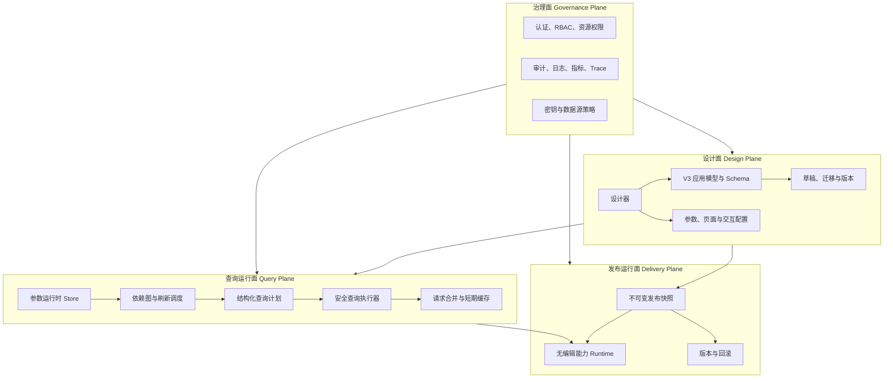

# Medical BI Designer 总体架构规划与开发合并方案

本文是 2026-08-03 起的总体架构与开发合并依据。更新至 2026-08-17：Phase7—Phase10 已完成验收并进入 `main`，当前停止在 Phase11 发布与治理之前。

本文保留 Phase7—Phase8 早期分支与 PR 队列，作为历史合并依据；当前代码、验收和主干状态以 [项目当前状态](../项目当前状态.md) 及最新 Phase 验收记录为准。

## 1. 项目整体目标

Medical BI Designer 的目标不是单纯的图表编辑器，而是面向医疗运营分析的低代码 BI 应用平台。完整能力链路为：

```text
数据源 → 数据集 → 字段与指标语义 → 参数 → 组件 → 页面 → 交互 → 发布 → 权限与治理 → 智能分析
```

架构建设遵循以下顺序：

1. 先保证查询结果正确、模型可迁移和运行状态可控。
2. 再建设多页面、联动、下钻和导航等应用能力。
3. 之后分离设计态与发布运行态，补齐版本、权限和审计。
4. 最后在可信语义、权限和证据链之上接入 AI。

## 2. 当前进度基线

### 2.1 代码与分支

| 基线 | 当前状态 | 说明 |
| --- | --- | --- |
| `origin/main` | `e455928` | 已包含 Phase7—Phase10；Phase10 经 PR #13 和 CI 后 squash 合并。 |
| Phase7—Phase9 合并基线 | `152be86` | PR #12 交付 V3 应用模型、可信查询运行时、多页面与事件基础。 |
| Phase10 交付提交 | `c24865f` | P10.0—P10.7 完成并正式 `ACCEPTED`。 |
| 当前阶段 | Phase11 前停点 | 发布快照、认证、RBAC、审计和生产发布尚未启动。 |

### 2.2 能力完成度

| 能力域 | 状态 | 当前边界 |
| --- | --- | --- |
| V2 数据与可视化底座 | 已完成 | 数据源、数据集、组件、图表、指标卡和画布可用。 |
| V3 应用模型 | 已完成 | V3 JSON、Schema、单默认页、主题与运行策略已建立。 |
| 迁移与存储 | 已完成 | V1/V2/V3 兼容读取、单写 V3、备份和失败回退可用。 |
| 参数定义中心 | 已完成 | 参数 CRUD、模板、字典、校验和持久化可用。 |
| 参数运行时 | 已完成 | 默认值、系统值、原子提交、去重和事务 ID 已实现。 |
| 数据集参数绑定 | 已完成 | P8.3 自动候选、人工映射、类型校验和刷新策略通过。 |
| 安全查询运行时 | 已完成 | P8.4 参数占位符、服务端聚合、排序、限制和 600 行对账通过。 |
| 参数控件与定向刷新 | 已完成 | P8.5 即时/手动提交、依赖图和定向刷新通过。 |
| 请求合并与缓存 | 已完成 | P8.6 查询键、并发合并、有界 TTL 缓存和强制刷新通过。 |
| 多页面与事件交互 | 已完成 | Phase9—10 已交付页面、事件、联动、下钻、导航、弹窗和安全外链。 |
| 发布、权限与审计 | 未开始 | Phase11 及生产治理阶段。 |

当前验证基线：Phase10 最终 Node 268/268、Chromium 19/19、生产构建 7006 modules、官方依赖审计各级别均为 0；仍保留既有大 Chunk 告警。

## 3. 总体架构

现阶段采用“前后端分离的模块化单体”。在领域契约、权限和发布模型稳定前不拆微服务；代码内部先形成清晰依赖方向，未来再按运行负载和故障边界拆出查询执行或发布运行时。



### 3.1 设计面

设计面保存“应用应该是什么”，包括页面、参数定义、组件配置、事件动作、主题和发布配置。参数当前值、查询结果、下钻栈和缓存都不写回设计 JSON。

V3 JSON、TypeScript 类型、JSON Schema、迁移器和固定样例必须作为一个契约单元演进。任何字段变化都要同时更新这四类资产，并验证旧版本兼容性。

### 3.2 查询运行面

查询运行面保存“当前会话正在发生什么”，包括参数值、来源、事务、依赖关系、请求状态、查询键和缓存。它不能直接修改设计态对象。

服务端查询必须区分两种接口：

- 预览接口只用于 SQL 编辑、字段识别和有限样本，明确标记 `sampled/limited`。
- 运行接口接收结构化查询计划，在服务端完成参数绑定、筛选、聚合、排序和限制，返回完整业务口径结果。

早期“服务端截断 200 行、浏览器再聚合”的路径不能作为正式运行结果。Phase8 已建立服务端执行计划，避免 SUM、COUNT、TOP、百分比和预警线基于截断样本计算。

### 3.3 发布运行面

编辑、预览和发布共用同一个无编辑能力的 `DashboardRuntime`。编辑器只是在 Runtime 外增加组件库、画布操作和属性面板，不能复制一套独立渲染逻辑。

发布时生成不可变快照，至少包含应用 ID、业务版本、Schema 版本、内容校验和、创建时间和发布人。草稿更新不得改变已发布版本。

### 3.4 治理面

当前服务只监听本机，适合单用户开发。任何非本机部署都必须先具备认证、RBAC、资源授权、审计和最小权限数据源账号。

SSL 配置必须与真实行为一致。现有 `verify-ca`、`verify-full` 不能继续映射到 `rejectUnauthorized: false`；若暂未实现证书链和主机名校验，应隐藏对应选项，不能提供虚假的安全保证。

## 4. 模块边界

### 4.1 前端目标模块

```text
src/
├─ app/                    # 路由、启动、错误边界
├─ domain/                 # V3 模型、规则、Schema、迁移
├─ modules/
│  ├─ designer/           # 设计器 UI 与命令
│  ├─ datasets/           # 数据源和数据集管理
│  ├─ parameters/         # 参数定义、运行时与控件
│  ├─ pages/              # 页面管理
│  ├─ interactions/       # 事件与动作配置
│  └─ publishing/         # 预览、发布和版本
├─ runtime/               # 共享运行时、依赖图和刷新调度
├─ api/                   # DTO、类型化客户端、错误协议
├─ stores/                # 设计态和会话态 Store
└─ shared/                # 通用 UI、样式和工具
```

依赖规则：`domain` 不依赖 Vue、浏览器或网络；业务页面不直接调用裸 `fetch`；Runtime 不依赖设计器面板；LocalStorage 通过存储端口访问。

### 4.2 后端目标模块

```text
server/
├─ bootstrap/             # 配置、启动、优雅关闭
├─ http/                  # 路由、控制器、中间件、DTO
├─ application/           # 用例编排和事务边界
├─ domain/                # 数据集、查询计划、发布规则
├─ query-runtime/         # 参数编译、聚合、缓存、限流
├─ repositories/          # 存储端口
└─ infrastructure/
   ├─ metadata/           # JSON 或元数据数据库适配器
   ├─ postgres/           # 连接池、方言和安全查询
   ├─ secrets/            # Windows、环境变量、密钥服务
   └─ observability/      # 日志、指标和 Trace
```

Phase8 不要求一次性搬完目录。每个 P8 小阶段只抽离本次需要的边界，并保持单进程部署。

## 5. 阶段路线

| 阶段 | 核心目标 | 架构出口 |
| --- | --- | --- |
| Phase7 | 稳定 V3 设计模型 | V3 Schema、迁移、存储、参数定义和默认页适配已完成。 |
| Phase8 | 建立可信查询运行时 | 参数绑定、服务端查询计划、定向刷新和缓存正确工作。 |
| Phase9 | 多页面和事件基础 | 页面实体、事件总线、条件和基础动作稳定。 |
| Phase10 | 应用交互 | 联动、下钻、导航、弹窗和跨页参数可运行。 |
| Phase11 | 发布与治理 | 共享 Runtime、不可变快照、版本、认证、RBAC 和审计可用。 |
| Phase12 | 真实 ODR 验证 | 数据对账、性能、安全、容灾和发布回滚验收通过。 |
| 智能阶段 | 可信 AI 分析 | AI 继承语义、权限和审计，结论有证据且可人工复核。 |

### 5.1 Phase8 完成顺序（历史）

1. P8.3 建立编码/别名匹配、人工绑定、类型兼容和刷新策略。
2. P8.4 建立服务端安全查询计划，同时完成参数占位符和服务端聚合；预览样本与正式结果分离。
3. P8.5 建立筛选控件、参数依赖图、事务去重和定向刷新。
4. P8.6 建立查询键、并发请求合并、有界 TTL 缓存和强制刷新。
5. P8.7 执行单元、API 集成、浏览器端到端、安全和数据对账验收。

Phase8 关闭前必须确认：客户端不能提交 SQL、字段名或运算符；同参数同查询不会重复执行；大于 200 行的数据集聚合结果与校验 SQL 一致。

## 6. 开发合并方案

### 6.1 合并原则

- Phase7 必须先进入 `main`，Phase8 PR 才能以稳定主干为基线。
- 功能、测试基础设施和文档治理使用独立 PR，避免回滚时互相绑定。
- 每个 PR 只覆盖一个可验收能力，不能以“后续会修”绕过失败测试。
- 安全查询、Schema 和迁移变更必须由至少一名非作者开发者审查。
- 合并采用普通 merge 或 squash PR；不在共享分支上强推和改写历史。

### 6.2 推荐 PR 队列（历史）

| 顺序 | PR 范围 | 来源与内容 | 合并门禁 |
| --- | --- | --- | --- |
| PR-01 | Phase7 完整基线 | `agent/phase7-v3-model-schema` → `main` | Phase7 62 项测试、构建、最终验收记录和敏感资产检查通过。 |
| PR-02 | Phase8 基础与运行时 | Phase8 方案、P8.1 Schema、P8.2 参数 Runtime | 71 项测试、构建通过；无未跟踪功能文件。 |
| PR-03 | 测试自动化 | Node 版本检查、Playwright、CI 与测试流程文档 | 本地与 CI 命令一致；E2E 不依赖私有数据；不夹带业务改动。 |
| PR-04 | P8.3 参数绑定 | 自动候选、人工映射、兼容性校验和组件配置 | 绑定合法/非法夹具、旧组件回归和 Schema 校验通过。 |
| PR-05 | P8.4 安全查询 | 结构化请求、占位符条件、服务端聚合和只读执行 | API 集成、安全输入、大数据聚合对账和超时测试通过。 |
| PR-06 | P8.5 控件与刷新 | 控件渲染、依赖图、定向刷新和请求取消 | Playwright 关键路径、循环/重复刷新检查通过。 |
| PR-07 | P8.6 缓存与交付 | 合并请求、TTL 缓存、强制刷新、Phase8 文档与验收 | 全量回归、构建、包体积记录和人工验收通过。 |

PR-02 在 PR-01 合并前可以暂时以 Phase7 分支为目标形成 stacked PR；PR-01 合并后，开发者应把 PR-02 更新到最新 `main`，解决冲突并重新跑全量校验。

### 6.3 Phase8 合并阻断项（已关闭）

以下条目保留为 Phase8 合并前检查记录，当前均已随 Phase7—Phase10 进入主干而关闭：

1. 当时 Playwright、CI、依赖和测试流程文件尚未提交，需先确定其属于独立 PR-03。
2. 确认 `npm test`、`npm run build` 在干净工作区通过，而不是依赖未跟踪文件。
3. 检查 Phase8 分支相对 `main` 的提交范围，避免 PR-02 再次包含已合并的 Phase7 差异。
4. 不把本地日志、数据库配置、凭据、截图和 `server/.data` 带入提交。

## 7. 每个 PR 的统一验收门禁

```powershell
npm ci
npm test
npm run build
git diff --check
git status --short
```

涉及 API 或浏览器行为时还必须执行对应集成/E2E 测试。PR 描述至少列出：范围、非范围、数据模型变化、兼容策略、测试结果、人工验证、风险和回滚方式。

禁止合并的情况包括：测试失败、Schema 与类型不一致、旧 V1/V2/V3 样例回归失败、敏感信息进入仓库、查询结果基于未声明截断样本，以及需要依赖未提交文件才能通过构建。

## 8. 关键架构决策

| 决策 | 结论 | 原因 |
| --- | --- | --- |
| 部署形态 | 继续模块化单体 | 当前领域和发布契约仍在演进，微服务收益不足。 |
| 看板模型 | 单写 V3、版本化迁移 | 保护历史草稿并保持后续扩展稳定。 |
| 状态边界 | 定义持久化，运行值仅会话内存 | 避免用户筛选污染设计稿。 |
| 查询执行 | 服务端结构化计划和聚合 | 保证数据正确性并阻断客户端 SQL 注入。 |
| 预览与运行 | 使用不同语义 | 样本预览不能冒充业务全量结果。 |
| 渲染 | 编辑、预览、发布共享 Runtime | 防止三套渲染逻辑长期漂移。 |
| 发布 | 不可变快照 | 支持审计、回滚和稳定访问。 |
| AI | 最后接入治理后的语义层 | 避免绕过口径、权限和证据链。 |

## 9. 生产化门禁

Phase8 合并不等于可以生产部署。系统对非本机开放前还必须完成：

- 真实 SSL 模式和证书校验。
- 身份认证、RBAC、资源授权和审计日志。
- 服务端元数据事务、乐观锁、备份和恢复。
- 查询并发配额、取消、超时、熔断、缓存和成本控制。
- 结构化日志、请求/查询 ID、指标、Trace 和告警。
- 依赖安全、数据脱敏、行列级权限和导出控制。
- 发布快照、灰度、回滚和灾难恢复演练。

## 10. 开发交接结论

Phase7—Phase10 已通过受保护 PR 和 CI 进入 `main`。当前架构主线停在 Phase11 前；下一阶段若启动，必须先冻结发布快照、共享运行时、认证、RBAC、审计和回滚边界。

本方案不授权自动提交、推送或合并。开发者完成每个 PR 的校验后，通过受保护分支和代码评审进入 `main`。
