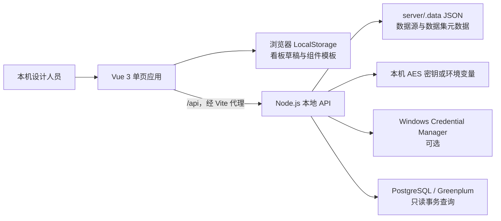
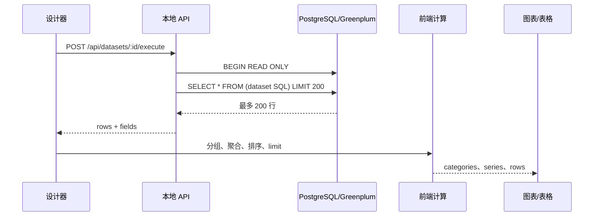
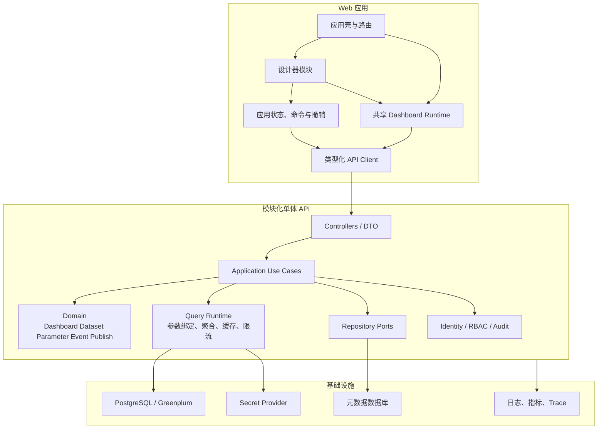

# Medical BI Designer 架构现状评审与演进路线

本文记录 2026-07-29 对当前代码基线的架构审查结果。结论是：现有架构适合作为单机 V2 原型继续验证产品能力，但还不是可供多人协作或生产部署的平台架构。进入 V3 前应先修复查询结果正确性、传输安全语义和持久化可靠性，再按“模块化单体”逐步拆分设计器、查询运行时和发布运行时。

本文描述的是仓库中的真实实现；[V3 整体架构](./V3整体架构.md)、[数据模型](./数据模型.md)、[参数体系](./参数体系.md) 和 [事件模型](./事件模型.md) 描述目标状态。规划文档中的能力在代码和测试落地前，不视为已经实现。

## 1. 评审范围与验证结果

本次审查覆盖：

- `src/`：Vue 设计器、数据源与数据集页面、模型、前端数据计算和 ECharts 渲染。
- `server/`：本地 HTTP API、PostgreSQL/Greenplum 查询、凭据加密和本机 JSON 存储。
- `tests/`、`.github/workflows/ci.yml`：自动化测试与持续集成。
- `docs/`、根目录说明文档：现状、V2 基线、V3 规划和交接信息的一致性。

2026-07-29 的本机验证结果：

| 检查项 | 结果 | 说明 |
| --- | --- | --- |
| `npm test` | 通过 | 7 个测试文件、24 项测试全部通过。 |
| `npm run build` | 通过 | TypeScript 检查和 Vite 生产构建通过。 |
| 前端产物 | 有警告 | JS 约 1,344 KB，gzip 约 450 KB；CSS 约 580 KB，gzip 约 79 KB。 |
| GitHub CI | 已具备 | Node 22 下执行 `npm ci`、测试和构建。 |
| API、浏览器端到端测试 | 缺失 | 当前测试集中在模型迁移、计算和配置等纯逻辑。 |

## 2. 当前真实架构

### 2.1 系统上下文



当前服务只监听 `127.0.0.1`，因此它的有效安全边界是“受信任的单机开发环境”。这能降低原型阶段的部署复杂度，但不能被解释为已经具备多用户访问控制。

### 2.2 前端分层

| 区域 | 当前实现 | 实际职责 |
| --- | --- | --- |
| 应用入口 | `src/main.ts`、`src/router/index.ts` | 初始化 Vue，注册三个同步加载路由。 |
| 设计器 | `src/views/DesignerHome.vue` | 看板状态、组件库、画布、拖缩、属性编辑、数据加载、模板、导入导出和本机保存。 |
| 数据管理 | `DataSourceManager.vue`、`DatasetManager.vue` | 数据源连接、数据集编辑、SQL 预览、状态和复制删除。 |
| 领域模型 | `src/models/dashboard.ts`、`src/models/bi.ts` | V2 看板、组件、字段、数据集和数据绑定类型。 |
| 兼容与计算 | `src/services/` | V1/V2 迁移、前端聚合与排序、KPI 和图表辅助计算、组件模板。 |
| 渲染 | `DataChart.vue`、`CanvasChart.vue` | ECharts 配置和实例生命周期。 |
| 本机状态 | 浏览器 `localStorage` | V2 看板草稿和医疗组件模板。 |

设计器当前是页面级单体。`DesignerHome.vue` 接近 900 行，既是 UI 组合层，又持有领域状态、运行时数据和持久化操作。这个结构在原型期迭代快，但继续加入参数、多页面、事件和发布后，会形成难以测试的共享状态和条件分支。

### 2.3 后端分层

后端目前由单个 `server/index.mjs` 提供，约 500 行，包含以下职责：

1. HTTP 路由与响应序列化。
2. 数据源、数据集的校验和规范化。
3. JSON 文件读写。
4. AES-256-GCM 加解密和 Windows 凭据读取。
5. PostgreSQL 连接创建、连接测试和 SQL 执行。
6. 只读 SQL 的文本检查、超时和行数限制。
7. Demo 数据适配。

这仍是一个合理的本地原型入口，但路由、用例、仓储和基础设施没有边界，导致任何存储替换、安全修复或查询能力升级都要修改同一文件。

### 2.4 当前核心数据流



这一数据流是当前最重要的架构事实：字段聚合发生在浏览器，服务端在聚合前最多只返回 200 行。数据量超过上限时，图表可能只计算样本而不是完整结果。

## 3. 架构问题与风险

优先级定义：

- `P0`：影响数据正确性或生产安全，扩展前必须修复。
- `P1`：会明显阻碍 V3 开发、稳定性或维护效率，应在对应阶段入口解决。
- `P2`：当前可接受的技术债，可随阶段演进处理。

### 3.1 P0：扩展前阻断项

| 问题 | 证据与影响 | 建议 |
| --- | --- | --- |
| 聚合基于截断后的数据 | API 最多返回 200 行，`queryResult.ts` 再在前端分组聚合。大数据集的 SUM、COUNT、排序、TOP 和百分比可能错误，且当前没有强制阻止用户把截断结果当成全量结果。 | 将聚合、筛选、排序和 limit 下推到查询服务或生成参数化聚合 SQL；响应中保留执行计划摘要、是否截断和统计口径。前端只做展示级转换。 |
| SSL 模式语义不真实 | UI 提供 `verify-ca`、`verify-full`，但连接池统一使用 `rejectUnauthorized: false`。用户选择证书校验时，实际没有完成证书链和主机名校验。 | `disable/prefer/require/verify-ca/verify-full` 分别映射为真实驱动配置；校验模式要求 CA，`verify-full` 还必须校验主机名。没有实现前应移除误导选项。 |
| 多用户部署没有身份与权限边界 | API 没有认证、授权、租户、资源所有权和审计；任何可访问服务的人都能查看数据源、执行数据集、修改或删除元数据。 | 在服务对非本机开放前，引入身份认证、RBAC、资源级授权和审计日志；默认拒绝匿名管理操作。 |
| JSON 文件不是可靠共享存储 | 数据源和数据集采用“读取全文件—修改数组—覆盖全文件”，没有锁、版本号、原子替换或事务。并发请求会丢更新，进程中断可能损坏文件。 | 单机阶段至少使用临时文件加原子替换、串行写队列和备份；多人阶段迁移到带事务的元数据数据库，并使用乐观锁版本。 |

### 3.2 P1：近期应解决的问题

| 问题 | 影响 | 建议落点 |
| --- | --- | --- |
| 设计器页面职责过度集中 | 参数、页面、事件继续加入后，状态依赖、重渲染和回归范围会快速扩大。 | Phase7 先抽出 `dashboard store`、命令/撤销栈、存储适配器和活动页选择器；UI 再按画布、组件库、属性面板、工具栏拆组件。 |
| API 单文件耦合 | 路由、安全、存储和数据库逻辑无法独立测试或替换。 | 拆成 `routes/controllers`、`application`、`domain`、`repositories`、`query-runtime` 和 `infrastructure`，仍保持单进程部署。 |
| 看板与元数据有两个事实来源 | 看板和模板只在 LocalStorage，数据源和数据集在服务端 JSON；无法跨浏览器恢复、协作、审计或发布。 | 服务端元数据存储成为权威来源；LocalStorage 仅保存临时草稿、会话状态或离线缓存。 |
| 设计态与运行态混在同一页面 | 预览只是设计器状态开关，查询和渲染复用页面内部状态；未来发布版容易携带编辑能力和草稿状态。 | 建立共享的无编辑能力 `DashboardRuntime`；编辑、预览和发布只传入不同配置快照与权限。 |
| 前端 API 访问重复 | 多个页面各自封装 `fetch`、错误解析和请求状态，契约容易漂移。 | 建立类型化 `api-client`，统一超时、错误码、取消、重试策略和 DTO 映射。 |
| 模型定义重复且缺少运行时校验 | `ParameterDefinition` 等结构在模型和页面中重复；TypeScript 不能校验导入 JSON 或 API 输入。 | 以版本化 JSON Schema 为契约，生成或共享 TypeScript 类型；所有导入、读取和 API 边界执行运行时校验。 |
| 文档状态存在漂移 | 部分交接文档仍写“没有 Git 提交和远程”，与当前仓库状态冲突；V3 规划容易被误当成实现。 | `项目当前状态.md` 只记录可验证事实；架构决策使用 ADR；规划文档明确状态、负责人和验证证据。 |
| 查询资源模型不可扩展 | 每次请求新建并销毁连接池，无法复用连接，也缺少并发、成本和取消控制。 | 建立按数据源管理的受控连接池，设置全局/用户/数据源并发限制；支持查询取消、成本阈值和熔断。 |
| 安全只依赖文本规则和事务 | SQL 关键词规则只能作为辅助；数据源账号是否最小权限没有强制门禁。 | 使用只读数据库角色、只读事务、语句超时、Schema 白名单和审计共同防护；必要时引入 SQL AST 校验。 |

### 3.3 P2：可计划处理的技术债

| 问题 | 当前影响 | 建议 |
| --- | --- | --- |
| 首屏包体积过大 | 本机构建可用，但首次加载和低配置终端体验受影响。 | 路由懒加载；按需引入 ECharts 图表和组件；拆分 vendor、designer、runtime chunk，并设置体积预算。 |
| 自动化测试层次不完整 | 纯逻辑回归较好，但 API、数据库适配、浏览器交互和迁移失败回退未覆盖。 | 增加契约测试、API 集成测试、PostgreSQL 容器测试、浏览器端到端测试和关键视觉回归。 |
| 缺少可观测性 | 出错主要依赖前端提示和控制台，无法定位慢查询与失败链路。 | 引入结构化日志、请求 ID、查询 ID、耗时与错误指标；生产阶段接入 tracing 和告警。 |
| 工程版本与产品版本不一致 | `package.json` 为 `0.1.0`，文档称 V2.0，发布与迁移定位困难。 | 定义产品版本、Schema 版本、API 版本和包版本的独立规则，并由发布流程自动写入构建信息。 |
| 本机能力耦合 Windows | Credential Manager 脚本只支持 Windows，影响 Linux 部署。 | 抽象 `SecretProvider`，本地使用 Windows Credential，部署环境接入环境变量或专用密钥服务。 |
| 缺少正式部署模型 | 当前只有开发启动、Vite 预览和本地 API。 | 在准备部署时补充环境配置、反向代理、健康检查、容器/服务定义、备份恢复和升级回滚。 |

## 4. 推荐目标架构

现阶段推荐“前后端分离的模块化单体”，不建议立即拆微服务。产品模型、权限、查询契约和发布流程尚在变化，过早拆服务会把本地代码耦合转化为分布式事务和接口耦合。



### 4.1 前端建议目录

```text
src/
├─ app/                     # 启动、路由、全局错误边界
├─ modules/
│  ├─ designer/            # 设计器 UI 与命令
│  ├─ datasets/            # 数据源和数据集管理
│  ├─ parameters/          # 参数定义与控件
│  ├─ pages/               # 多页面设计
│  ├─ interactions/        # 事件与动作配置
│  └─ publishing/          # 预览、发布和版本
├─ runtime/                # 编辑、预览、发布共享运行时
├─ domain/                 # 无 UI 的模型、规则和迁移
├─ api/                    # DTO、类型化客户端、错误协议
├─ stores/                 # 应用状态和会话状态
└─ shared/                 # 通用组件、样式、工具
```

`domain/` 不依赖 Vue 或浏览器 API；`runtime/` 不依赖设计器面板；业务模块不能直接调用裸 `fetch` 或直接写 LocalStorage。

### 4.2 后端建议目录

```text
server/
├─ bootstrap/              # 配置、启动和优雅关闭
├─ http/                   # 路由、控制器、中间件、DTO
├─ application/            # 用例编排和事务边界
├─ domain/                 # 核心实体、值对象和规则
├─ query-runtime/          # 安全查询、聚合、缓存、限流
├─ repositories/           # 存储接口
├─ infrastructure/
│  ├─ metadata/            # JSON 本地适配器或数据库适配器
│  ├─ postgres/            # 数据源连接与方言
│  ├─ secrets/             # Windows、环境变量、密钥服务
│  └─ observability/       # 日志、指标、Trace
└─ tests/
```

目录拆分的目标是形成依赖方向，不是单纯移动文件：HTTP 层调用应用用例，应用层依赖领域和接口，基础设施实现接口，领域层不反向依赖 HTTP、文件系统或数据库驱动。

## 5. 必须明确的架构原则

1. **服务端元数据是权威来源。** 浏览器存储只承担草稿缓存和会话状态，不能承担发布、协作和审计。
2. **聚合在数据源或查询服务完成。** 浏览器不得基于截断明细计算业务指标。
3. **设计态、会话运行态、发布态分离。** 设计 JSON、当前用户筛选值和不可变发布快照不能互相覆盖。
4. **所有持久化模型均版本化。** TypeScript 类型、JSON Schema、迁移器和测试样例必须同步演进。
5. **发布内容不可变。** 发布生成带 Schema 版本、业务版本、校验和与时间戳的快照；草稿修改不影响已发布版本。
6. **安全采用多层防护。** RBAC、只读数据库角色、只读事务、参数绑定、超时、限流和审计共同生效。
7. **先模块化再服务化。** 只有当查询执行、发布运行时或 AI 任务出现独立扩缩容和故障隔离需求时，才考虑拆服务。

## 6. 未来新增能力清单

### 6.1 平台基础能力

- 服务端看板、模板和数据集元数据存储。
- 草稿自动保存、乐观锁、冲突检测和版本历史。
- 统一配置中心、环境分层、密钥提供器和备份恢复。
- 身份认证、角色权限、资源授权、租户边界和审计日志。
- 结构化日志、运行指标、查询追踪、告警和运维面板。
- 正式部署、升级、回滚、健康检查和灾难恢复流程。

### 6.2 查询与语义层

- 参数化 SQL、日期区间、多选参数和空值策略。
- 服务端分组、聚合、排序、分页、TOP N 和总计。
- 数据集查询计划、字段血缘、口径说明和影响分析。
- 连接池、并发配额、查询取消、超时、熔断和结果缓存。
- PostgreSQL/Greenplum 方言适配与数据类型标准化。
- 指标中心、维度中心、业务术语、单位和口径版本。
- 行列级权限、脱敏策略和数据导出控制。

### 6.3 看板应用与运行时

- V3 多页面模型、页面管理和稳定 ID。
- 参数中心、筛选控件、级联参数和依赖图。
- 统一事件总线、条件、动作、联动、下钻、导航和弹窗。
- 编辑、预览、发布共享的运行时渲染器。
- 不可变发布快照、灰度发布、回滚和访问入口。
- 响应式布局、主题 Token、组件插件协议和可访问性。
- 撤销/重做、复制粘贴、对齐吸附、图层和快捷键治理。

### 6.4 质量与研发效能

- JSON Schema 合法/非法样例和迁移幂等测试。
- API OpenAPI 契约及客户端类型生成。
- 数据库适配集成测试和只读安全回归。
- Playwright 关键路径端到端测试与视觉回归。
- 性能基准、包体积预算、查询 SLO 和容量压测。
- 架构决策记录（ADR）、变更日志和自动化发布说明。

### 6.5 AI 与高级分析

AI 能力应在指标口径、权限和审计稳定后接入：

- 自然语言生成受约束的分析意图或查询计划。
- 指标异常检测、趋势解释、归因候选和洞察卡片。
- 看板布局与组件推荐。
- 语义检索、字段映射和数据集推荐。
- AI 输出证据链、置信度、权限继承和人工确认。

AI 不应直接拼接并执行 SQL，也不能绕过数据权限、查询限额和审计。

## 7. 建议实施路线

| 阶段 | 目标 | 主要交付 | 退出条件 |
| --- | --- | --- | --- |
| A：V2 架构加固 | 保证正确、安全、可迁移 | 服务端聚合契约、截断提示、真实 SSL 语义、原子存储、API 与安全测试 | 大于 200 行数据集的指标与校验 SQL 一致；SSL 模式测试通过。 |
| B：Phase7 模型基础 | 建立 V3 契约 | V3 类型、JSON Schema、迁移报告、存储适配器、活动页适配 | V1/V2/V3 可读，单写 V3，迁移可回退且幂等。 |
| C：Phase8 查询运行时 | 参数安全进入查询链路 | 参数注册表、绑定、依赖图、服务端查询计划、缓存 | 参数变化只刷新受影响组件，结果完整且可追踪。 |
| D：Phase9—10 应用交互 | 多页面与统一事件 | 页面模型、事件总线、动作执行器、联动、下钻和导航 | 循环可检测，跨页参数和返回路径稳定。 |
| E：Phase11 发布与治理 | 形成可交付应用 | 共享运行时、发布快照、认证、RBAC、审计、版本回滚 | 发布版不依赖编辑器状态，权限和审计验收通过。 |
| F：Phase12 生产验证 | 验证真实医疗场景 | ODR 对账、性能、安全、容灾和验收材料 | 数据正确性、SLO、安全和恢复演练全部通过。 |
| G：智能分析 | 在可信语义层上增加 AI | 受控分析计划、洞察、解释和证据链 | 权限不旁路，结论可追溯，可人工复核。 |

阶段 A 不应被 Phase7 的功能开发跳过。否则 V3 会把当前查询正确性和存储可靠性问题带入更复杂的参数与联动链路。

## 8. 近期可执行任务

建议按以下顺序建立任务，不需要一次性重写：

1. 为“超过 200 行的聚合结果”添加失败测试，先暴露当前错误，再设计服务端聚合请求/响应契约。
2. 修正 SSL Mode，实现真实证书校验，或暂时只保留已经正确支持的模式。
3. 将 `server/index.mjs` 的文件仓储、数据源连接和查询执行抽成独立模块，并补 API 集成测试。
4. 为 JSON 写入增加串行队列、临时文件原子替换、备份和恢复测试。
5. 建立 `api-client`，替换页面中的重复 `fetch` 实现。
6. 抽离设计器 store、持久化适配器、查询会话和活动页选择器。
7. 落地 V3 JSON Schema、迁移器、迁移报告和幂等测试。
8. 路由和 ECharts 按需加载，设置生产包体积预算。
9. 更新 `项目当前状态.md` 和 AI 交接中的过期 Git 描述，并为重要决策建立 ADR。

## 9. 服务拆分触发条件

在以下条件出现前，保持模块化单体：

- 查询执行需要独立扩缩容、资源隔离或异步排队。
- 发布运行时需要与设计器不同的可用性、安全边界和发布节奏。
- AI/算法任务成为长耗时、可重试的异步作业。
- 单体部署已经无法满足明确、量化的容量或故障隔离目标。

触发后优先考虑拆出“查询执行服务”或“发布运行时”，而不是按前端页面或数据库表机械拆分微服务。拆分前必须先具备稳定 API 契约、统一身份、追踪 ID、幂等和运维能力。

## 10. 本次评审结论

当前 V2 的模型迁移、前端计算和组件配置已经有一组可用的自动化基线，项目并非需要推倒重来。正确的演进方式是保留现有产品能力，先修复数据正确性和安全语义，再把高耦合页面与 API 拆成有依赖方向的模块。

进入 V3 的架构门禁应至少包括：

- 聚合不再依赖截断后的浏览器数据。
- SSL 选项与实际连接行为一致。
- 持久化具备原子性、版本和恢复能力。
- V3 类型、Schema、迁移器和测试由同一套样例约束。
- 设计态、运行态和发布态的职责边界已在代码中建立。
- 对外开放前完成认证、授权、审计和最小权限数据源治理。
