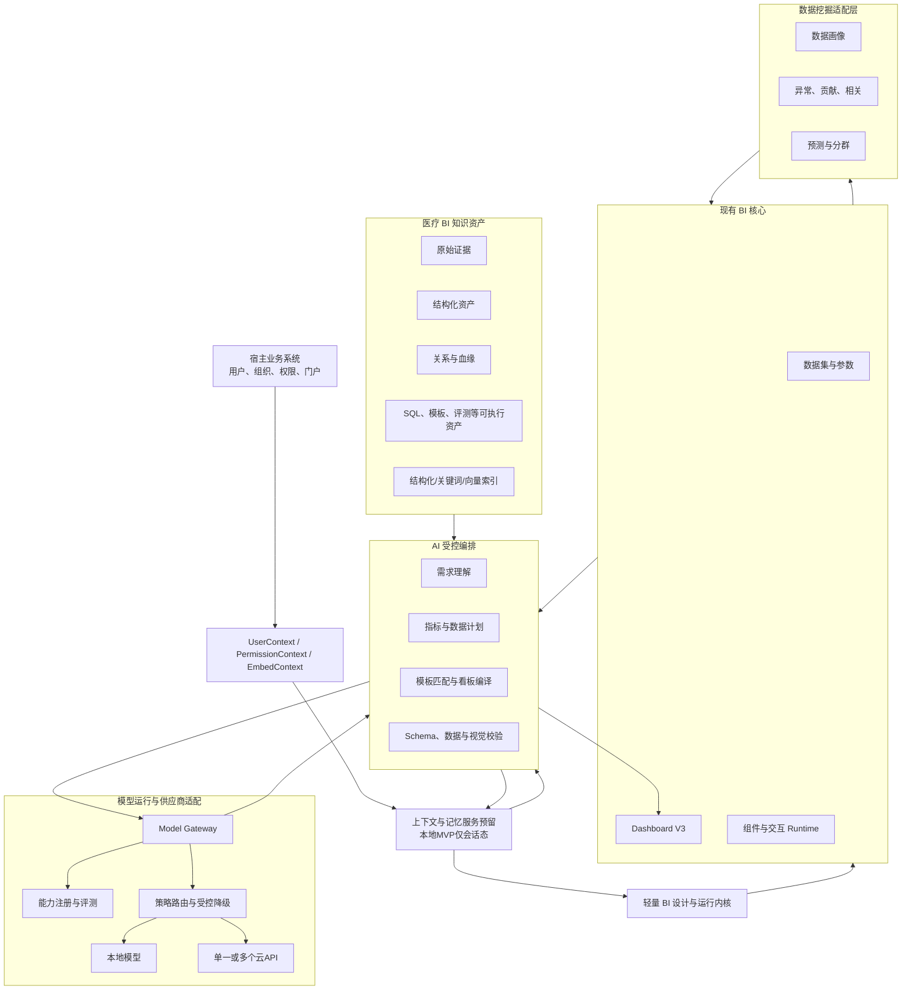
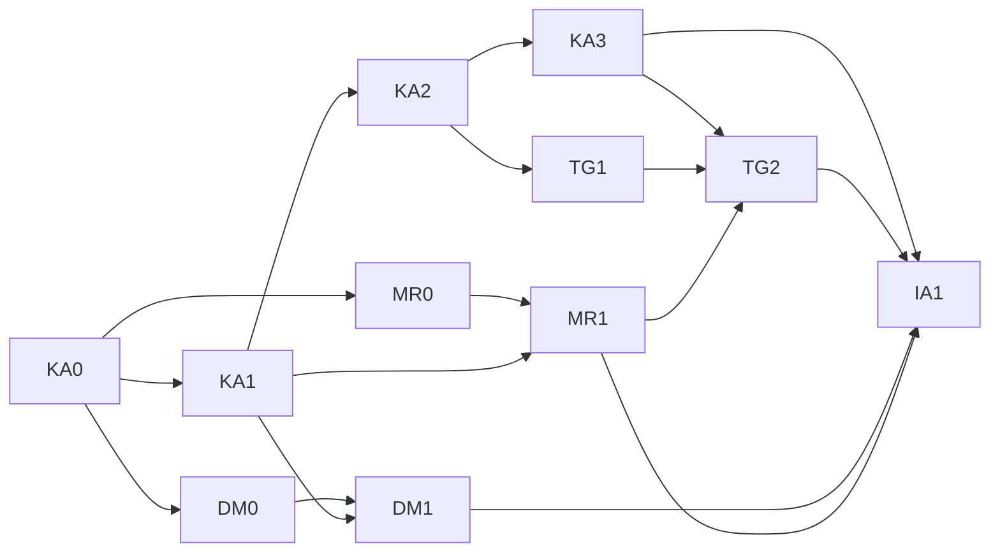

# 医疗 BI AI 知识资产与智能分析路线规划

版本：V2.0（已确认）

日期：2026-08-26

适用项目：`medical-bi-designer`

当前状态：后续权威路线；当前仅授权规划与规范设计，不授权功能开发、数据库写入、提交或发布

本文融合现有《AI知识库建设方案》、附件中的昨日整理稿、现有《AI智能分析方向》以及架构、产品、医疗 BI、AI、知识库和数据挖掘多角色评审结论。它用于替代“先建目录、再直接开发 Agent”的粗粒度路线，是后续交给 Codex、Antigravity 和人工专家执行的权威总规划。

确认记录：项目负责人于 2026-08-26 确认 V2 路线。确认只冻结产品方向、优先级、阶段和验收原则；进入 KA0、开发工具、整理私有资料或执行数据库操作仍需分别授权。

## 一、执行结论

`medical-bi-designer` 后续不向完整 BI 平台扩张，而定位为：

> 面向医疗运营分析、可嵌入其他业务系统的轻量 BI 设计与运行内核；通过可验证的医疗 BI 知识资产、看板模板和数据挖掘能力，提高看板设计与分析效率。

后续优先级正式调整为：

| 方向 | 优先级 | 当前决策 |
| --- | --- | --- |
| 轻量 BI 产品边界与知识规范 | P0 | 立即规划并冻结，不立即开发功能 |
| 医疗 BI AI 知识资产 | 核心 | 后续第一主线 |
| 看板模板知识库 | 重点 | 与知识资产同步建设 |
| 数据挖掘 | 核心 | 规范冻结后尽早并行验证 |
| AI 自动生成看板 | 重点 | 在知识、模板和校验闭环成立后建设 |
| 模型运行与供应商适配 | P0 横切能力 | KA0 同步冻结契约；实际接入按业务项目选择 |
| 上下文与多用户聊天记忆 | 低优先级预留 | 本地 MVP 仅做单会话临时上下文；集成部署后再持久化和多用户化 |
| PostgreSQL | 持续维护 | 当前唯一优先数据库方言 |
| MySQL、Oracle | 暂缓 | 只预留能力描述，不开发适配器 |
| 权限集成 | 待定 | 只预留宿主权限上下文接口 |
| 独立发布与完整治理 | 待定 | 不进入当前核心路线 |

本轮最重要的工作不是建立向量数据库，也不是立即开发多个 Agent，而是完成“医疗 BI AI 知识资产建设规范”，并用一个业务场景证明知识能够被审核、关联、验证和执行。

## 二、多角色评审与裁决

### 2.1 资深架构师视角

知识库、AI 和数据挖掘必须使用现有 Dashboard V3、参数、数据集、组件和事件契约，不能再创建第二套看板模型或渲染系统。继续采用模块化单体；算法是否独立为 Python 服务，由依赖隔离、并发和部署需求决定，不因未来可能性提前微服务化。

### 2.2 资深产品经理视角

核心建设用户是医疗 BI 工程师、实施顾问和医院运营分析人员；院领导、科主任主要是看板消费者。AI 首版只生成有依据、可校验、可编辑的草稿，不自动发布、不覆盖已有看板，也不取代业务口径审核。

### 2.3 资深医疗 BI 工程师视角

指标、粒度、时间口径、分子分母、可加性、模型关联基数和 SQL 输出契约是知识资产的核心。看板截图只能还原视觉候选，不能推断指标公式、数据集和交互。正式模板必须完成“业务问题—指标—模型—SQL—组件—Dashboard JSON”闭环。

### 2.4 资深 AI 工程师视角

不能让一个大模型从自然语言直接生成 SQL 和最终看板。应建立结构化中间产物、受控编排、Schema 校验、SQL 安全验证、数据对账和人工确认。多个 Agent 首期只作为逻辑角色，不急于建设自治多 Agent 系统。

### 2.5 知识库建设专家视角

原方案适合作为知识范围目录，但还不是可执行规范。必须补充稳定 ID、来源证据、版本、有效期、生命周期、关系、可信等级、安全标签、评测集和变更影响分析。向量索引只是检索手段，不是事实源。

### 2.6 数据挖掘专家视角

数据挖掘是核心方向，但必须从数据质量、描述诊断和可复现基线开始。算法输出应注册为普通只读派生数据集，继续进入现有图表、表格和指标卡；不能只返回一段 AI 文本，也不能把相关性描述成因果关系。

### 2.7 综合裁决

多角色讨论后的统一决策如下：

1. 保留原方案的十类知识范围，但目录不再等于知识模型。
2. 先完成一个“科室经营分析”纵向样板，再扩展到三个 MVP 场景。
3. 知识资产和模板建设优先于知识加载器、向量库和 AI Agent。
4. 数据挖掘协议可在规范冻结后并行推进，不必等所有知识整理完成。
5. PostgreSQL 是当前唯一执行方言；MySQL、Oracle 只保留未来扩展位。
6. 权限中心属于宿主系统，BI 只接收 `PermissionContext`，当前不开发。
7. 公开代码仓库与私有医疗知识、业务模板、SQL 和数据物理隔离。

## 三、产品边界

### 3.1 BI 内核负责

- 数据源、数据集、字段语义和指标配置。
- Dashboard V3 JSON、页面、参数、组件、事件、联动、下钻和预览。
- 医疗 BI 知识资产的引用和校验。
- 看板模板的编译、绑定和生成草稿。
- 数据挖掘任务配置和结果展示。
- 接收宿主系统传入的用户、页面、权限和环境上下文。

### 3.2 BI 内核近期不负责

- 通用 ETL、数据交换或完整数仓建模平台。
- 独立用户、组织、角色和权限中心。
- 完整门户、发布中心、监控、计费和多租户运营。
- 全数据库通用查询工作台。
- 通用 AutoML 或 MLOps 平台。
- 诊疗决策、患者风险预测或治疗建议。
- 无人工确认的 AI 自动执行和自动发布。

## 四、总体架构



知识资产分为三层：

1. 行业公共层：医疗业务、通用指标、政策和 BI 设计规则。
2. 产品能力层：组件目录、Dashboard Schema、布局和交互约束。
3. 项目私有层：医院物理表字段、SQL、数据范围、定制指标和模板。

项目私有层默认不进入公开 GitHub 仓库。

## 五、模型运行与供应商适配

Codex 和 Antigravity 是当前个人建设知识资产、分析文档和辅助开发的工具，不是业务项目运行时必须依赖的模型服务。正式项目必须通过统一模型网关接入本地模型或外部 API，使知识资产、Agent 契约和 Dashboard 生成流程不绑定某个厂商、产品或模型名称。

### 5.1 支持的部署形态

| 形态 | 适用场景 | 主要约束 |
| --- | --- | --- |
| 个人建设工具 | Codex、Antigravity 用于资料整理、规范和开发 | 不作为生产运行依赖，不承诺接口稳定性 |
| 本地模型 | 医院内网、敏感数据、离线环境 | 受硬件、上下文长度、推理速度和模型能力限制 |
| 单一云 API | 快速接入、能力集中、维护简单 | 受数据出域、成本、配额和供应商可用性限制 |
| 多 API | 不同模型承担抽取、规划、视觉或生成任务 | 需要统一契约、路由、评测、成本和故障处理 |
| 混合部署 | 敏感任务留在本地，非敏感复杂任务使用云模型 | 必须先执行数据分级，禁止失败后自动把敏感内容转发到云端 |

系统不要求所有客户采用同一种部署。业务项目可根据内网、数据安全、预算和模型效果选择其中一种或组合。

### 5.2 统一模型网关

浏览器和 Dashboard Runtime 不直接调用模型厂商 API。模型调用统一经过宿主后端或独立 `ModelGateway`，由它负责能力发现、请求适配、结构化输出、超时、重试、限流、审计和用量统计。

建议的供应商适配契约：

```ts
interface ModelProviderAdapter {
  getCapabilities(): ModelCapabilities
  invokeStructured(request: StructuredModelRequest): Promise<StructuredModelResult>
  embed?(request: EmbeddingRequest): Promise<EmbeddingResult>
  rerank?(request: RerankRequest): Promise<RerankResult>
  analyzeVision?(request: VisionRequest): Promise<VisionResult>
  healthCheck(): Promise<ProviderHealth>
}
```

统一请求不携带厂商专属 Prompt 或参数，至少包含：

- 任务类型和所需能力。
- 输入知识资产引用及版本。
- 目标输出 Schema。
- 数据安全等级和是否允许出域。
- 最大上下文、超时、成本或资源预算。
- `UserContext`、`PermissionContext` 的引用，而不是数据库凭据。

统一结果至少包含：

- 结构化产物和 Schema 校验结果。
- 证据引用、未决问题和置信提示。
- 实际供应商、模型、模型版本和部署位置。
- 延迟、用量、重试和路由/降级轨迹。
- Prompt/编排版本、知识资产版本和请求追踪 ID。

### 5.3 模型能力档案

不能因为“接入了大模型”就默认它具备全部能力。每个实际模型必须建立 `ModelCapabilityProfile`，通过本项目黄金评测后，才获得对应任务资格。

建议能力标签包括：

- `knowledge_extraction`：从 PDF、Excel、HTML、SQL、截图抽取候选知识。
- `structured_output`：稳定生成符合 JSON Schema 的结构化结果。
- `retrieval_planning`：选择正确知识域、过滤条件和关系路径。
- `metric_mapping`：识别指标、粒度、时间口径和冲突。
- `query_planning`：生成受控查询计划或 SQL 草稿。
- `dashboard_planning`：生成页面、组件槽位和交互计划。
- `dashboard_compilation`：生成合法 Dashboard V3 草稿。
- `vision_understanding`：识别看板布局、组件和视觉层级。
- `mining_interpretation`：解释算法结果、误差和限制。
- `embedding`、`reranking`：知识检索索引和重排。

模型档案至少记录：

```yaml
provider_id: local-hospital-a
model_id: model-x
model_version: 2026-08
deployment: local
capabilities: []
evaluation_suite_version: 1.0.0
evaluation_results: {}
security_scope: restricted
status: approved_for_limited_tasks
```

能力资格以“模型 + 版本 + 推理配置 + 评测集版本”为单位。模型升级、量化方式变化、上下文配置变化或供应商静默升级后，必须重新评测，不能沿用旧结论。

### 5.4 任务路由与受控降级

路由器根据以下信息选择模型：

```text
任务所需能力
∩ 数据安全与出域策略
∩ 已通过的评测资格
∩ 上下文长度和多模态要求
∩ 延迟、并发、成本和当前健康状态
```

路由规则必须遵守：

1. 安全策略先于效果和成本。
2. 敏感任务禁止因本地模型失败而自动回退到云 API。
3. 只能回退到通过同类任务评测且输出契约兼容的模型。
4. 多模型不得各自维护一套 Dashboard、指标或查询协议。
5. 模型不可用时允许返回“需要人工处理”，不能为了可用性放宽安全和质量门禁。
6. 供应商切换不能改变知识事实源、资产 ID、指标口径和 Dashboard Schema。

### 5.5 实际模型能力边界

模型可以：

- 从授权资料生成 `candidate` 知识。
- 根据已批准资产提出指标、模型、SQL、模板和算法建议。
- 生成符合中间契约的分析计划和 Dashboard 草稿。
- 对算法结果进行基于证据的解释和展示建议。
- 在证据不足、冲突或模型能力不足时明确要求确认。

模型不可以：

- 自行把知识从 `candidate` 升级为 `approved`。
- 获取或保存数据库密码、API 密钥和患者可识别明细。
- 绕过数据集、查询网关和权限上下文直接访问数据库。
- 直接执行未经校验的 SQL、任意代码、DDL 或 DML。
- 自行改变指标口径、阈值、分子分母和权限规则。
- 自动发布或覆盖正式看板。
- 将相关性描述为因果关系，或输出临床诊疗决策。
- 在未经授权的情况下用客户私有资料训练或微调模型。

本地模型能力不足时，应缩小任务，例如只做实体抽取、分类或结构填充；复杂规划继续保留人工处理，而不是降低验收门槛。

### 5.6 知识检索与嵌入模型

知识库不绑定某个嵌入模型。每套向量索引必须记录嵌入供应商、模型、版本、切分策略、维度和资产发布版本。不同嵌入模型生成的向量不得混入同一索引；更换嵌入模型时重新构建索引并运行检索黄金集。

本地部署可以完全使用本地嵌入和重排模型；混合部署也必须在检索前按知识安全等级过滤，禁止先把未授权全文发送给云模型再过滤结果。

### 5.7 密钥、数据和审计

- API Key 和本地模型访问凭据由宿主系统密钥服务、环境变量或受控配置提供，不进入浏览器、Dashboard JSON、知识资产和公开仓库。
- 发送给外部模型的数据必须经过最小化、去标识化和安全分级；默认只发送完成任务所需的知识片段和聚合数据。
- 审计至少记录任务、模型、版本、输入资产版本、输出摘要、路由、降级、用量和人工确认结果。
- 业务原始数据默认不用于供应商训练；是否允许供应商留存由项目部署策略显式决定。
- 本地模型日志同样不得记录患者明细、数据库凭据或完整敏感 Prompt。

### 5.8 模型准入评测

模型能力边界由评测集决定，至少覆盖：

- 知识抽取字段完整率、证据定位率和幻觉率。
- 指标、粒度、时间口径和模型映射正确率。
- 结构化输出及 Dashboard V3 Schema 通过率。
- 查询计划安全性、SQL 可执行率和基准结果一致性。
- 看板组件、布局和交互有效性。
- 数据挖掘解释对评价指标、不确定性和限制的忠实度。
- 敏感信息拒答、越权请求阻断和提示注入防护。

同一个模型可以只批准部分能力。例如，本地小模型可被批准用于知识分类和实体抽取，但不能用于 SQL 或 Dashboard 草稿生成。未通过的能力必须由其他已批准模型或人工承担。

### 5.9 与数据挖掘的边界

大模型不是统计和算法计算引擎。数据画像、异常检测、相关性、贡献、预测和聚类由可复现算法执行；模型只负责理解需求、选择已批准的挖掘任务模板、解释既有结果和建议图表。任何数值结论必须来自算法结果或受控查询，不能由语言模型估算。

### 5.10 上下文与多用户聊天记忆

上下文和记忆由产品自身管理，不能依赖某个模型供应商的会话 ID 或聊天历史。否则切换本地模型、云 API 或多个供应商时会丢失语义，也无法保证多用户隔离。

需要明确区分五类内容：

| 类型 | 作用 | 生命周期与边界 |
| --- | --- | --- |
| 请求上下文 `TurnContext` | 当前问题、当前看板、参数、选择组件 | 单次请求，默认不持久化 |
| 会话上下文 `ConversationSession` | 当前聊天的最近消息、摘要、未决任务 | 会话级，可配置过期 |
| 用户记忆 `UserMemory` | 用户确认的偏好、常用场景和纠正 | 用户级，需可查看、删除和关闭 |
| 工作区记忆 `WorkspaceMemory` | 项目约定、数据模型选择、已确认模板偏好 | 工作区级，不能跨项目自动共享 |
| 知识资产与审计 | 已批准事实、来源证据和不可变操作记录 | 不属于聊天记忆，分别治理 |

推荐的统一上下文信封：

```ts
interface ContextEnvelope {
  tenantId?: string
  userId: string
  workspaceId: string
  conversationId: string
  sessionId: string
  permissionContextRef?: string
  knowledgeReleaseId: string
  activeDashboardId?: string
  activePageId?: string
  memoryPolicy: {
    persistence: 'none' | 'session' | 'user' | 'workspace'
    retentionDays?: number
    allowedScopes: Array<'conversation' | 'user' | 'workspace'>
  }
}
```

模型调用前由上下文服务按预算组装：

```text
当前请求
+ 最近会话窗口
+ 历史摘要
+ 与当前任务相关的已授权记忆
+ approved知识资产证据包
+ 当前看板、参数和权限上下文
→ 本次模型输入
```

多用户部署必须满足：

1. 存储和检索以 `tenantId + userId + workspaceId + conversationId` 隔离，禁止仅按自然语言相似度跨用户召回。
2. 缓存、向量命名空间、摘要和后台任务同样遵守用户与工作区边界。
3. 每次取回记忆时重新应用当前权限，历史上有权不代表现在仍有权。
4. 用户记忆默认只保存用户明确确认的偏好和纠正，不自动沉淀患者信息、数据库凭据、SQL 结果明细或敏感对话。
5. 用户能够查看、纠正、删除、导出或关闭长期记忆；组织管理员只能在授权边界内管理策略。
6. 对话写入使用版本号、幂等键或乐观并发控制，避免多个窗口覆盖摘要和记忆。
7. 聊天记录、长期记忆、知识事实和审计日志采用不同保留策略，不能混在一张表或一个向量集合中。
8. 模型供应商返回的会话标识只作为调用元数据，不能成为产品唯一的上下文事实源。

本地 MVP 的边界刻意保持简单：

- 只支持单个本地用户或固定测试用户。
- 只保存当前会话的临时上下文、摘要和当前 Dashboard 状态。
- 默认不建设长期用户画像、多用户聊天库、跨设备同步和组织级记忆。
- 允许应用重启后清空临时记忆，测试使用固定上下文夹具保证可复现。
- 本地 MVP 的验收重点仍是知识、模板、模型能力、数据挖掘和 Dashboard 草稿正确性。

集成部署后再根据真实业务需求增加持久化会话、多用户隔离、长期偏好记忆、保留策略和用户控制，不反向阻塞本地 MVP。

## 六、从“资料目录”升级为“知识资产系统”

### 6.1 完整加工链路

```text
原始资料
→ 来源登记与分级
→ 解析/OCR/表格和组件提取
→ 知识候选抽取
→ 实体归一与关系链接
→ 医疗BI专家审核
→ 自动结构/语义/执行/展示验证
→ 版本发布
→ 混合索引
→ AI或人工使用
→ 反馈、影响分析和回归
```

AI 或 Antigravity 自动抽取的内容只能进入 `candidate`，不能自动成为正式知识。

### 6.2 事实源规则

- 人工维护的说明型资产使用“YAML Front Matter + Markdown 正文”作为唯一事实源。
- Dashboard JSON、查询计划、算法配置和评测夹具等可执行产物使用 JSON/SQL 作为唯一事实源。
- 索引、向量、汇总清单和关系缓存均由工具生成，禁止人工双写。
- 原始文件只读保留并计算哈希；正式知识必须能反查原文页码、表格、SQL 文件或截图区域。

### 6.3 推荐的私有知识库结构

```text
medical-bi-ai-knowledge/
├─ 00_governance/              # 规范、Schema、枚举、评审和发布规则
├─ 01_sources/                 # 原始资料清单和source_manifest
├─ 02_assets/
│  ├─ 01_business/
│  ├─ 02_policy/
│  ├─ 03_industry_solution/
│  ├─ 04_metrics/
│  ├─ 05_data_model/
│  ├─ 06_sql_case/
│  ├─ 07_dashboard_template/
│  ├─ 08_bi_rule/
│  ├─ 09_permission/
│  ├─ 10_version_history/
│  ├─ 11_algorithm/
│  └─ 12_mining_task_template/
├─ 03_relations/               # 显式关系、血缘和影响索引
├─ 04_executable/              # SQL、Dashboard fixture、binding map
├─ 05_evaluations/             # 黄金问题、基准结果、视觉基线
├─ 06_generated/               # 自动生成索引，不人工维护
└─ releases/                   # 已批准知识资产版本清单
```

原方案的十类内容继续保留；新增算法、挖掘任务和评测资产，用于支撑用户确定的数据挖掘核心方向。

## 七、统一资产治理规范

### 7.1 通用元数据

所有正式资产至少包含：

```yaml
asset_id: metric.outpatient.visit_count
asset_type: metric
name: 门诊人次
version: 1.0.0
status: approved
domain: outpatient
aliases: []
source_refs: []
owner: 医疗BI负责人
reviewers: []
confidence: verified
security_level: internal
valid_from: 2026-01-01
valid_to: null
tags: []
relations: []
checksum: sha256:...
```

资产状态统一为：

```text
draft → candidate → reviewed → approved → deprecated
```

AI 正式生成默认只能使用 `approved` 且在有效期内的资产。

### 7.2 稳定 ID 和关系

资产通过稳定 ID 和版本引用，禁止仅按中文名称关联。关键关系包括：

- `derivedFrom`：来源于原始证据或上游资产。
- `uses`：使用指标、模型、规则或模板。
- `computedFrom`：指标由字段或其他指标计算。
- `validatedBy`：由 SQL、断言或评测用例验证。
- `materializedAs`：Blueprint 编译成具体 Dashboard。
- `supersedes`：新版本替代旧版本。

核心血缘必须贯通：

```text
原始资料
→ 业务场景和问题
→ 指标版本
→ 模型字段
→ SQL或查询计划
→ 数据集输出字段
→ 组件语义槽位
→ 看板模板
→ Dashboard草稿
→ AI生成记录
```

### 7.3 生命周期和变更影响

不能只在 `10_version_history` 中写一篇变化记录。每个资产自身必须带版本、有效期和变更原因，并能够沿关系识别影响：

```text
政策变化
→ 指标口径变化
→ 模型或SQL变化
→ 数据集输出变化
→ 看板模板变化
→ 黄金评测重新执行
```

重大口径不兼容变化升级主版本；兼容扩展升级次版本；文字和证据修正升级补丁版本。

## 八、核心知识对象规范

### 8.1 业务场景 `BusinessScenario`

必须说明使用对象、管理目标、需要支持的决策、分析问题、指标、维度、比较方式、适用范围和不能推断的内容。一个业务场景不是一篇概述文章，而是一组可以被验证的管理问题。

### 8.2 指标 `MetricDefinition`

指标必须包含：

- 业务定义、统计对象和公式。
- 基础粒度与支持粒度。
- 时间语义、时区和期间对齐规则。
- 聚合方式及时间、组织维度可加性。
- 分子、分母、去重键和排除条件。
- 单位、格式、目标方向、空值和重复规则。
- 支持维度、强制过滤、模型字段映射。
- 来源、版本、校验案例和适用范围。

比率不得通过平均科室比率计算全院值；快照指标必须说明日末、月末或实时；人次、人数、病例数必须明确去重键。

### 8.3 数仓模型 `DataModelDefinition`

必须包含表用途、数据库方言、Schema、对象名、数仓分层、真实粒度字段、主键和业务键、时间字段、字段类型与业务语义、敏感级别、关联基数、更新频率和数据质量规则。

一对多关联必须明确重复累计风险。业务日期、入库日期和快照日期不能混为一个时间字段。

### 8.4 SQL 案例 `SqlCase`

SQL 是可执行资产，不是粘贴的代码片段。必须包含：

- `dialect: postgresql`。
- 业务问题、指标、维度和模型引用。
- 参数类型、操作符、必填和空值策略。
- 输出粒度、字段名、类型和语义角色。
- 只读、超时和最大返回行数。
- 验证参数、数据库快照、断言和执行证据。
- 已知限制和适用版本。

聚合必须在完整数据上执行，不能将预览截断样本当作正式结果。默认只允许审核后的 `SELECT/WITH` 和结构化参数绑定。

### 8.5 看板模板 `DashboardTemplateBlueprint`

模板不是某个环境的完整组件快照，而是可迁移的语义蓝图。每个正式模板同时保存：

```text
template-blueprint.json       通用业务、布局、指标和交互槽位
dashboard-v3.fixture.json     固定样例环境中可直接运行的V3看板
binding-map.json              语义槽位到数据集/字段的绑定证据
visual-baseline.png           固定数据下的视觉基线
conversion-report.md          来源、取舍和不支持能力
```

模板必须覆盖四个层面：

- 业务模板：受众、目标和管理问题。
- 视觉模板：布局、层级、主题、装饰和响应方式。
- 数据模板：指标、维度、数据集和参数槽位。
- 交互模板：筛选、联动、下钻、页面跳转和弹窗。

### 8.6 BI 设计规则 `BiDesignRule`

规则需要包含适用条件、推荐、禁止项、优先级、理由、例外和可测试断言，不能只写“趋势使用折线图”。例如，多序列过多如何处理、双轴何时允许、比率如何展示分母、排名如何定义 Top N，都应成为可判断规则。

### 8.7 算法 `AlgorithmDefinition`

必须说明算法版本、适用问题、输入字段角色、最小样本、缺失值处理、参数范围、输出契约、评价指标、随机种子、适用条件和已知限制。

### 8.8 挖掘任务模板 `MiningTaskTemplate`

把业务问题、指标、维度、时间字段、算法、默认参数、输出粒度和推荐 BI 组件连接起来。它是 AI 或用户发起挖掘任务的受控入口。

### 8.9 权限知识 `PermissionKnowledge`

权限知识只描述概念、数据域、资源动作和模型字段绑定。禁止将 `dept_code like ...` 之类自由文本直接作为可执行权限规则。真实范围由宿主系统 `PermissionContext` 提供，当前只保留接口位置。

## 九、模板素材转换规范

统一转换流水线：

```text
原始资产登记
→ 页面与组件拆解
→ 业务语义识别
→ 数据与参数抽取
→ 通用组件映射
→ Template Blueprint
→ 人工审核
→ 环境绑定
→ DashboardApplicationV3
→ 数据、交互和视觉验收
```

### 9.1 HTML

可抽取 DOM、CSS 布局、图表配置、数据请求、字段绑定、筛选、事件、跳转和主题。若只剩 Canvas 像素而无配置，只能形成视觉候选，不能声称恢复数据和交互。

### 9.2 FineReport/FVS

可作为知识来源读取页面、组件、数据集、参数、公式、控件联动、超链、钻取、弹窗、JavaScript 和资源。每个源组件必须记录目标组件、映射置信度、数据/交互恢复情况、人工审核要求和不支持原因。

目标不是复刻源工具，而是转换为通用 BI 语义。自定义 JavaScript、复杂单元格公式、三维和暂不支持组件必须进入“不支持清单”，不得静默降级。

### 9.3 截图

截图只能用于推断页面分区、组件候选、视觉层级、相对尺寸、颜色和装饰。无法可靠推断指标公式、数据集、参数、联动、下钻和隐藏页面，因此状态只能是 `visual_draft`。

### 9.4 坐标标准化

先保存源画布的归一化坐标，再编译到目标画布：

```text
xRatio = x / sourceCanvasWidth
yRatio = y / sourceCanvasHeight
wRatio = width / sourceCanvasWidth
hRatio = height / sourceCanvasHeight
```

编译时再吸附到设计器网格，避免将某个源系统的绝对像素当作唯一模板。

## 十、AI 自动看板受控链路

首版采用一个编排器和多个逻辑角色，不急于建设自治多 Agent：

```text
用户需求
→ AnalysisBrief
→ 知识检索与证据包
→ MetricPlan
→ DatasetPlan
→ QueryArtifact
→ 可选MiningPlan/MiningResult
→ DashboardPlan
→ DashboardDraft
→ Schema/引用/SQL/数据/视觉验证
→ 人工确认
```

Agent 之间传递结构化契约，不传递无法校验的散文。

### 10.1 主要中间产物

- `AnalysisBrief`：受众、目标、问题、时间、粒度和待确认项。
- `MetricPlan`：指标资产 ID、版本、维度、口径、理由和证据。
- `DatasetPlan`：模型、字段、关联、参数、输出和质量要求。
- `QueryArtifact`：方言、参数、输出 Schema、只读验证和风险。
- `MiningResult`：算法、结果数据集、评价指标、解释和限制。
- `DashboardPlan`：页面、区域、组件槽位、筛选和交互。
- `DashboardDraft`：V3 JSON、资产版本清单、验证报告和未决项。

### 10.2 人工审核点

至少保留四个门槛：

1. 业务目标和使用对象确认。
2. 指标口径、粒度及模型映射确认。
3. SQL 样本、数据范围和基准结果确认。
4. 最终布局、交互和分析解释确认。

AI 只能创建草稿，不能将资产升级为 `approved`，也不能发布或覆盖已有看板。

## 十一、数据挖掘路线

### 11.1 能力分层

| 层级 | 能力 | 首期定位 |
| --- | --- | --- |
| L0 数据理解 | 画像、缺失、重复、分布、时间和机构覆盖 | 必做 |
| L1 描述诊断 | 同比环比、异常、贡献度、相关性、分层对比 | 核心 |
| L2 预测分群 | 时间序列、回归、分类、聚类、特征重要性 | 逐项验证 |
| L3 行动建议 | 规则发现、情景模拟、资源配置建议 | 后续，严格限制 |

首批 MVP 只做数据画像、异常检测、相关性/贡献分析和趋势预测。聚类、分类和复杂预测在基线稳定后再进入。

### 11.2 统一协议

```text
MiningRequest
= 数据集引用 + 数据快照 + 字段角色 + 时间粒度
+ 算法与参数 + 过滤条件 + 权限上下文引用 + 资源限制

MiningResult
= 结果数据集 + 模型卡 + 评价指标 + 可解释信息
+ 不确定性 + 数据质量警告 + 推荐图表 + 完整血缘
```

首版可先使用本地任务或轻量适配器。出现 Python 依赖隔离、并发或独立部署需求后，再形成算法服务：

```http
POST /v1/mining/jobs
GET  /v1/mining/jobs/{jobId}
GET  /v1/mining/jobs/{jobId}/result
POST /v1/mining/jobs/{jobId}/cancel
```

### 11.3 与 BI 衔接

挖掘结果注册为只读派生数据集，并继续使用现有 `dataConfig`、参数和组件。推荐映射：

| 挖掘结果 | 推荐组件 |
| --- | --- |
| 异常检测 | 折线/散点、警戒线、条件格式表格 |
| 趋势预测 | 实际值、预测值和上下界组合图 |
| 影响因素/贡献度 | 横向柱图、排名表 |
| 聚类 | 散点、气泡、分群明细表 |
| 相关性 | 散点和表格；热力图作为组件缺口 |
| 数据画像 | KPI、柱图、饼图和明细表 |

AI 解释必须读取算法结果、置信度和证据，不能自行重新计算数值。L3 不得将相关性包装为因果；涉及临床诊疗的任务不进入首期。

## 十二、混合检索与评测

### 12.1 不是只做 RAG

单纯向量 RAG 只能回答“资料中写了什么”，不能稳定判断指标冲突、粒度适配、SQL 正确性、模板兼容和版本有效性。

推荐检索顺序：

```text
状态/有效期/业务域/安全级别过滤
→ 结构化字段检索
→ 关键词与向量召回
→ 关系遍历
→ 规则重排
→ 返回证据包
```

向量库只是生成索引，结构化资产及其证据才是事实源。

### 12.2 黄金评测集

每个用例至少包含：

- 用户问题及预期业务场景。
- 预期指标 ID 和版本。
- 允许和禁止的模型。
- SQL 或基准结果指纹。
- 推荐组件、模板和布局约束。
- 必须引用的证据。
- 权限上下文和风险提示。

评测维度包括：检索召回、证据引用、指标/粒度正确性、SQL 可执行与结果一致性、Dashboard Schema、组件和交互有效性、算法复现性、人工审核通过率。

## 十三、七级质量门禁

### G0 来源与安全

来源、授权、敏感级别和文件哈希可追踪；清除患者明细、账号密码、连接信息和无权使用的材料。

### G1 结构

Schema、ID、版本、状态和引用通过；重复 ID、悬空引用和无效版本为零。

### G2 业务语义

使用对象、管理问题和决策目的明确；指标与政策由人工专家审核。

### G3 粒度与口径

基础粒度、可加性、分子分母、去重键、时间语义、空值和排除规则完整。

### G4 血缘

业务问题到指标、模型、SQL、数据集、组件、模板和生成记录全链路可追溯。

### G5 可执行性

PostgreSQL SQL 通过只读、参数、输出契约和基准结果验证；算法固定数据和参数可复现。

### G6 Dashboard

V3 JSON 可导入、保存、重载和预览；组件、参数、事件、页面、Tab、跳转和下钻引用合法；视觉基线无明显错位和数据空白。

### G7 AI 准入

只有 `approved` 资产进入正式上下文；黄金问题通过；存在歧义或证据不足时必须返回“需要确认”，不得编造。

正式资产要求 100% 具备来源、版本、状态和安全标签；关系引用、输出 Schema 和 Dashboard JSON 必须 100% 通过机器校验。

## 十四、分阶段实施路线

不继续沿用原 Phase11“发布治理”编号，改用四个核心工作流，并预留一个低优先级工作流：

- `KA`：Knowledge Asset，知识资产。
- `TG`：Template & Generation，模板与自动生成。
- `DM`：Data Mining，数据挖掘。
- `MR`：Model Runtime，模型运行、供应商适配和能力评测。
- `CM`：Context & Memory，上下文和多用户聊天记忆；不进入本地 MVP 核心链路。

### KA0：规范冻结——现在执行，不开发业务功能

交付：产品边界、目录、资产 Schema、ID/关系/版本/生命周期、来源与安全规则、Agent 中间契约、模型供应商中立契约、评测和门禁。

完成定义：每种资产至少有一个完整样例；任取一个指标、模型、SQL 和模板能够完整表达并形成关系；不存在 Markdown、YAML、JSON 三份事实源；模型和上下文契约不绑定供应商；经用户和各角色评审通过。

### KA1：单场景纵向样板

建议选择“科室经营分析”。参考规模：10～15 个管理问题、15～30 个指标、5～10 张模型、10～20 个 SQL、2～3 个模板和一组黄金问题。

完成定义：从业务问题可追踪到指标、模型、SQL、模板和证据；SQL 与基准结果一致；模板能在当前设计器导入和运行。

### KA2：三场景 MVP 资产集

在单场景规范成立后，扩展为：院领导运营总览、科室经营分析、门诊或住院运营分析。

参考总规模：3 个场景、20～30 个问题、30～40 个指标、10～15 张模型、20～30 个 SQL、3 个主模板加 2 个变体、25～40 条 BI 规则、不少于 30 条黄金问题。

数量只是工作量参考；闭环、质量和可追溯性才是验收标准。

### KA3：知识校验、注册与混合检索

交付来源登记、候选抽取、Schema/引用校验、人工审核、版本发布、关系索引、检索上下文打包和黄金评测。

完成定义：新资料可完整经过 `raw → candidate → reviewed → approved → indexed`；资产变更能够识别并回归受影响的 SQL、模板和评测用例。

### TG1：模板 Blueprint 与 V3 编译

交付通用 Blueprint、固定 fixture、binding map、视觉基线和转换报告。

完成定义：模板可替换指标/模型映射；V3 JSON 可加载、编辑、保存和重载；核心视觉和交互通过人工及自动验证。

### TG2：AI 自动看板 MVP

依赖 `KA3 + TG1 + MR1`。实现受控编排、指标/模型/SQL/模板选择、V3 JSON 生成和人工审核入口。

完成定义：黄金场景可从自然语言生成可编辑草稿；指标和数据正确；JSON 100% 合法；所有选择有知识资产和证据；不自动发布。

### DM0：挖掘协议与实验基线

可在 KA0 完成后与 KA1 并行。冻结请求/结果/错误/质量警告契约，为数据画像、异常、相关/贡献和趋势预测建立固定输入、朴素基线和预期结果。

### DM1：挖掘能力接入 BI

依赖 `DM0 + KA1`。结果作为普通派生数据集进入现有组件，并记录算法、参数、数据版本、误差、不确定性和血缘。

### MR0：模型运行契约与能力评测规范

作为 KA0 的并行规划内容，不接入真实模型。冻结 `ModelProviderAdapter`、`ModelCapabilityProfile`、任务/结果契约、数据出域策略、模型黄金评测和路由规则。

### MR1：首个业务运行模型适配

依赖 `MR0 + KA1`。根据实际业务项目选择一种本地模型或一种云 API 作为首个运行适配器，并只开放已通过评测的能力。Codex/Antigravity 不作为该阶段默认生产依赖。

### MR2：多供应商路由与混合部署

属于需求触发阶段。只有出现多个实际模型、成本/质量分工或本地与云混合需求时才实现路由、故障隔离和受控降级；不得提前建设复杂调度平台。

### CM0：上下文与记忆契约预留

作为 KA0 的低成本规划项，只冻结 `ContextEnvelope`、上下文类型、隔离键、保留策略和用户控制边界，不开发持久化聊天服务。

### CM1：本地单用户会话上下文

在本地 AI MVP 确实需要连续对话时启用。仅维护当前会话窗口、摘要、当前看板和参数状态；允许重启清空，不建设长期用户记忆。

### CM2：集成部署后的多用户记忆

属于低优先级、需求触发阶段。实现多用户/工作区隔离、持久化聊天、长期偏好记忆、权限重检、并发控制、保留期限和用户删除/导出能力。

### CM3：组织级记忆治理

在真实多用户部署稳定后评估。处理组织共享记忆、审核发布、跨项目复用和合规留存；不能把未经审核的个人聊天直接升级为组织知识。

### IA1：智能分析闭环

依赖 `KA3 + TG2 + DM1 + MR1`：AI 判断问题是否需要挖掘，生成任务，读取结果和限制，推荐图表并加入可编辑 Dashboard 草稿。

总体依赖关系：



MySQL/Oracle、权限适配和正式发布治理继续作为需求触发型 Backlog，不进入上述核心链路。

## 十五、Codex、Antigravity 与人工角色协作

| 角色 | 主要职责 | 禁止事项 |
| --- | --- | --- |
| Codex | 规范、Schema、关系模型、校验器、集成契约、测试和门禁 | 不凭空批准业务口径 |
| Antigravity | PDF/Excel/截图/HTML/FVS/SQL解析、模板逆向、知识候选初稿 | 不把初稿直接标记为正式资产 |
| 医疗 BI 专家 | 审核指标、模型、SQL、模板和分析解释 | 不用口头确认替代版本记录 |
| 产品负责人 | 冻结范围、场景、优先级和验收结论 | 不在阶段中途无记录扩域 |
| 架构负责人 | 审核模块边界、安全和演进决策 | 不因未来需求提前平台化 |
| AI/算法负责人 | 审核编排、评测、算法、解释和适用边界 | 不以模型能运行代替业务有效 |

标准流程：

```text
原始材料登记
→ Antigravity生成candidate
→ Codex执行Schema和引用校验
→ 医疗BI/业务专家审核
→ 标记approved
→ 生成索引
→ 运行黄金评测
→ 才允许AI正式使用
```

每个交给 Codex 或 Antigravity 的任务包必须写清：

- 目标、范围、输入文件和来源。
- 每个资产的用途、粒度、输入、输出和消费者。
- 明确不处理的内容和安全边界。
- Schema 和目标资产版本。
- 验收命令、人工检查项和基准结果。
- 对现有指标、SQL、模板和评测的影响。
- 是否允许修改代码、数据库、提交、推送或合并。

## 十六、首期验收基线

### 16.1 KA0 验收

- 每类资产有 Schema、样例和责任人。
- ID、引用、版本、状态和安全分级规则明确。
- 原始证据和正式资产边界明确。
- 本地模型、云 API 和多供应商模式使用同一中间契约；模型能力按评测授权。
- 数据出域、密钥、审计和受控降级规则明确。
- 请求、会话、用户、工作区记忆、知识资产和审计的边界明确。
- 本地 MVP 明确只使用单用户临时会话上下文，多用户持久化不作为当前门禁。
- 现有一个指标、模型、SQL、模板可按规范完整表达。
- 用户确认后才允许进入批量整理或工具开发。

### 16.2 三场景 MVP 验收

- 三个场景均形成业务问题到可运行 V3 看板的闭环。
- 正式指标 100% 有粒度、公式、时间语义、来源和验证案例。
- 正式 SQL 100% 通过 PostgreSQL 只读执行和输出契约验证。
- 正式模板 100% 通过 V3 Schema、导入、预览和基础交互测试。
- 正式组件 100% 能追溯到指标、字段、SQL 和模板来源。
- 不存在未知字段、未知指标、悬空关系和未披露降级。
- 黄金问题存在歧义时返回“需要确认”，不得强行生成。

### 16.3 数据挖掘 MVP 验收

- 统一请求和结果契约冻结。
- 数据画像、异常、相关/贡献和趋势预测均有固定基准数据。
- 与朴素基线比较，而不是只证明算法能运行。
- 结果可作为普通数据集进入 BI。
- 模型卡、评价指标、参数、随机种子、数据版本和限制可追溯。
- 数据不足、粒度错误或未来信息泄漏时能够拒绝产生确定结论。

## 十七、当前未决项

以下事项保留为待定，不阻塞 KA0：

1. 私有知识库最终存储在独立 Git 仓库、文档库还是二者组合。
2. 首个样板最终选择“科室经营分析”还是素材更完整的其他场景。
3. 知识审核责任人和 `approved` 发布权限。
4. 混合检索的具体技术选型；KA0 不选择向量数据库。
5. 数据挖掘首版采用本地 Python 适配器还是独立服务。
6. 权限样例何时转化为正式 `PermissionContext` 契约。
7. MySQL、Oracle 何时出现真实需求并进入适配。
8. 首个实际业务项目使用本地模型、云 API 还是混合模式。
9. 本地模型硬件预算、上下文长度、并发和响应时间要求。
10. 哪些知识、数据和任务允许发送到外部模型。
11. 首批需要认证的模型能力，以及对应的质量、成本和延迟阈值。
12. 集成部署后的聊天保留期限、用户删除/导出和组织管理策略。
13. 长期记忆是否默认关闭，以及哪些偏好必须经用户确认后保存。
14. 多用户环境的租户、用户、工作区和会话标识由哪个宿主接口提供。

## 十八、下一步建议

下一步只启动 `KA0：知识资产规范冻结`，并在其中完成 `MR0` 的供应商中立契约、模型能力评测规范以及 `CM0` 的上下文边界预留；不接入真实模型，不开发持久化聊天、长期记忆、知识加载器、Agent、算法服务、权限或多数据库适配。

KA0 推荐交付形态为：

```text
一个主规范
+ 各类资产Schema
+ 每类至少一个样例
+ 一个科室经营纵向样板包
+ 一组黄金问题
+ 一个模型能力档案样例和模型任务评测样例
+ 一个 ContextEnvelope 及单用户临时会话夹具
+ 一份评审与验收记录
```

只有当这套规范能够完整表达并验证一个真实指标、一个真实模型、一条参数化 SQL 和一个可运行 Dashboard 模板后，才进入批量知识建设。
